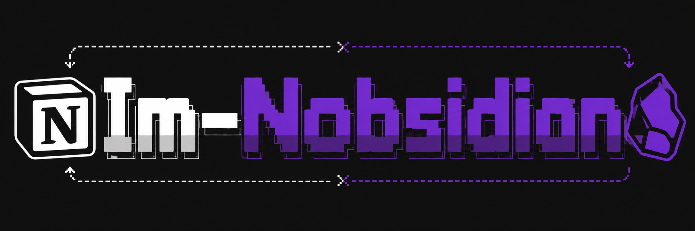

<p align="center">
  
</p>

<h1 align="center">Im-Nobsidian</h1>

<p align="center">
  <strong>세계 최초이자 유일한 Obsidian ↔ Notion 양방향 동기화 도구.</strong>
</p>

<p align="center">
  <a href="https://github.com/JaylenAI/Im-Nobsidian/actions/workflows/ci.yml"></a>
  <a href="https://www.npmjs.com/package/im-nobsidian"></a>
  <a href="LICENSE"></a>
  <a href="https://nodejs.org"></a>
  <a href="https://www.npmjs.com/package/im-nobsidian"></a>
</p>

<p align="center">
  <a href="README.md">English</a> · <a href="docs/06-devlog/CHANGELOG.md">변경 이력</a> · <a href="CONTRIBUTING.md">기여 가이드</a> · <a href="SECURITY.md">보안 정책</a>
</p>

---

Obsidian에서 편집하면 Notion에 반영됩니다. Notion에서 편집하면 Obsidian에 반영됩니다. 복사-붙여넣기도, 내보내기-가져오기도, 수동 동기화도 필요 없습니다. `nobsi sync` 한 번이면 양쪽이 완벽하게 동기화됩니다 — 서식, 속성, 폴더 구조 모두.

모든 경쟁 도구는 단방향입니다. Im-Nobsidian은 진정한 **양방향** 동기화와 충돌 해결, 속성 매핑, 왕복 보존을 제공하는 최초이자 유일한 오픈소스 프로젝트입니다.

## 주요 특징

**진정한 양방향 동기화** &nbsp; 어느 쪽에서 편집하든 양쪽에 반영됩니다. "내보내고 가져오기"가 아닌, 변경 감지와 델타 업데이트 기반의 실제 양방향 동기화입니다.

**25+ 블록 타입 보존** &nbsp; 제목, 코드 블록, 수식(LaTeX), 콜아웃, 토글, 테이블, 체크리스트, 컬럼, 구분선, 임베드, 미디어(audio/video/pdf/file), 탭 블록 — 모두 양방향으로 정확하게 변환됩니다. 색상, 밑줄, Notion 전용 블록은 보존 마커로 라운드트립이 보장됩니다.

**스마트 부분 업데이트** &nbsp; 변경이 적을 때는 전체 덮어쓰기 대신 search-and-replace로 부분 업데이트합니다. 같은 페이지에서 다른 사람이 편집한 내용이 보존됩니다.

**프론트매터 ↔ Notion 속성** &nbsp; YAML 프론트매터가 Notion 데이터베이스 속성에 직접 매핑됩니다. 21종 읽기 + 15종 쓰기를 지원하며, 읽기전용 속성(formula, rollup 등)은 자동으로 스킵됩니다.

**충돌 해결 내장** &nbsp; 양쪽에서 같은 파일을 수정하면 Im-Nobsidian이 감지하고, 실제 원격 내용을 비교하여 보여줍니다. 로컬 유지 / 원격 유지 / 수동 해결 중 선택할 수 있습니다. 데이터 유실은 절대 없습니다.

**다중 데이터베이스 동기화** &nbsp; 여러 Notion 데이터베이스를 각각 별도 로컬 폴더에 동기화합니다. 데이터베이스별 속성 매핑과 필터를 설정할 수 있으며, 데이터베이스 페이지가 프론트매터 속성을 가진 개별 마크다운 파일이 됩니다.

**파일 첨부 자동 다운로드** &nbsp; Notion의 Excel, PDF, Jupyter Notebook 등 파일 첨부가 자동으로 로컬 볼트에 다운로드됩니다. 내부 `file://` 프로토콜 링크도 Notion API를 통해 해석되어 로컬에 저장됩니다.

**깊은 자식 페이지 탐색** &nbsp; 리스트, 문단, 제목, 토글 등 어떤 블록 안에 중첩된 자식 페이지도 발견하여 동기화합니다. 최상위 자식만이 아닌, 계층 구조의 모든 페이지를 찾아냅니다.

**폴더 구조 = 페이지 계층** &nbsp; Obsidian 폴더 트리가 Notion 페이지 계층에 1:1로 매핑됩니다. `프로젝트/기획안.md` → Notion "프로젝트" 하위 "기획안" 페이지.

**설정 없는 상태 관리** &nbsp; 데이터베이스 설치도, 서버 실행도 필요 없습니다. `.im-nobsidian/` 폴더의 로컬 SQLite 파일로 자동 관리되며, 유저가 만질 일은 없습니다.

**라이브러리 + CLI + 플러그인** &nbsp; CLI 도구로 사용하거나, Node.js 라이브러리로 커스텀 연동을 만들거나, (곧 출시) Obsidian 커뮤니티 플러그인으로 설치할 수 있습니다.

## 빠른 설치

### Linux, macOS, WSL2, Termux

```bash
curl -fsSL https://raw.githubusercontent.com/JaylenAI/Im-Nobsidian/main/scripts/install.sh | bash
```

### Windows (PowerShell)

```powershell
irm https://raw.githubusercontent.com/JaylenAI/Im-Nobsidian/main/scripts/install.ps1 | iex
```

### 직접 설치

Node.js 20+가 이미 있다면:

```bash
npm install -g im-nobsidian
```

설치 없이 바로 실행:

```bash
npx im-nobsidian sync
```

## 시작하기

### 1. Notion Integration 생성

1. [notion.so/my-integrations](https://www.notion.so/my-integrations) 접속
2. **"새 통합 만들기"** 클릭 → 이름 입력 → 제출
3. **Internal Integration Secret** 복사 (`ntn_`으로 시작)

### 2. 페이지에 연결

Notion에서 동기화할 페이지 열기 → 우측 상단 `···` → **연결** → 생성한 통합 추가

### 3. 초기화

```bash
cd ~/your-obsidian-vault
nobsi init
```

대화형 설정이 토큰을 묻고, 사용 가능한 페이지를 보여줍니다. 선택하면 끝입니다.


### 4. 동기화

```bash
nobsi sync     # 양방향 — pull 후 push
nobsi push     # Obsidian → Notion만
nobsi pull     # Notion → Obsidian만
nobsi watch    # 파일 변경 감시 + 자동 동기화
```

이제 볼트와 Notion 워크스페이스가 연결되었습니다.

## 실제 동작

<table>
<tr>
<td align="center"><strong>nobsi pull</strong></td>
<td align="center"><strong>nobsi push</strong></td>
</tr>
<tr>
<td></td>
<td></td>
</tr>
<tr>
<td align="center"><strong>nobsi sync</strong></td>
<td align="center"><strong>nobsi status</strong></td>
</tr>
<tr>
<td></td>
<td></td>
</tr>
<tr>
<td align="center"><strong>nobsi diff</strong></td>
<td align="center"><strong>nobsi resolve</strong></td>
</tr>
<tr>
<td></td>
<td></td>
</tr>
<tr>
<td align="center"><strong>nobsi watch</strong></td>
<td></td>
</tr>
<tr>
<td></td>
<td></td>
</tr>
</table>

## CLI 명령어

| 명령어              | 설명                                    |
| ------------------- | --------------------------------------- |
| `nobsi init`        | 대화형 설정 — Notion 토큰 + 루트 페이지 |
| `nobsi push`        | 로컬 변경사항을 Notion에 반영           |
| `nobsi pull`        | Notion 변경사항을 로컬에 반영           |
| `nobsi sync`        | 양방향 동기화 (pull → push)             |
| `nobsi status`      | 동기화 상태 + 충돌 표시                 |
| `nobsi diff [경로]` | 로컬과 Notion 간 차이 표시              |
| `nobsi resolve`     | 동기화 충돌 해결                        |
| `nobsi watch`       | 파일 변경 감시 + 자동 동기화            |

모든 명령어에 `--dry-run` 옵션을 추가하면 변경 없이 미리 확인할 수 있습니다.

### 비대화형 모드 (CI / 스크립트)

```bash
nobsi init --token ntn_xxx --root-page-id abc123 --non-interactive
nobsi sync --dry-run
```

## 동작 원리

```
Obsidian 볼트                          Notion 워크스페이스
┌──────────────┐                    ┌──────────────────┐
│  프로젝트/    │   nobsi push       │  📄 프로젝트      │
│   기획안.md   │  ───────────────►  │    📄 기획안      │
│   메모.md     │                    │    📄 메모        │
│  회의록.md    │  ◄───────────────  │  📄 회의록        │
│              │   nobsi pull       │                   │
└──────────────┘                    └──────────────────┘
        │                                    │
        └──────── nobsi sync ────────────────┘
                    (양방향)
```

### Push (Obsidian → Notion)

1. 볼트의 `.md` 파일 스캔
2. SHA-256 해시로 마지막 동기화 상태와 비교
3. 변경된 파일 변환: 프론트매터 → 속성, 마크다운 → Notion 블록
4. Notion API로 페이지 생성/수정 (3 req/s 제한 준수)

### Pull (Notion → Obsidian)

1. 루트 페이지 하위 페이지를 재귀적으로 읽기
2. `last_edited_time`으로 변경 감지
3. Notion 블록 → 마크다운, 속성 → 프론트매터 변환
4. 이미지를 첨부파일 폴더에 다운로드 (중복 제거)

### 충돌 해결

양쪽에서 같은 파일을 수정한 경우:

- `ask` — 선택 요청 (CLI 기본값)
- `local-wins` — Obsidian 버전 유지
- `remote-wins` — Notion 버전 유지
- `manual` — 충돌 마커 삽입 후 수동 해결

## 지원 변환 기능

| 기능                                   | Push |    Pull     |
| -------------------------------------- | :--: | :---------: |
| 제목, 본문, 볼드/이탤릭/취소선         |  ✅  |     ✅      |
| 코드 블록 (30+ 언어)                   |  ✅  |     ✅      |
| 순서/비순서/체크박스 리스트            |  ✅  |     ✅      |
| 링크 및 위키링크                       |  ✅  |     ✅      |
| 콜아웃 / Notion 콜아웃 블록 (접기)     |  ✅  |     ✅      |
| 수학 수식 (LaTeX, 인라인 + 블록)       |  ✅  |     ✅      |
| 테이블                                 |  ✅  |     ✅      |
| 구분선                                 |  ✅  |     ✅      |
| 토글 블록                              |  ✅  |     ✅      |
| 컬럼 레이아웃                          |  ✅  |     ✅      |
| 색상, 밑줄                             |  ✅  |   ✅ 보존   |
| 미디어 (audio / video / pdf / file)    |  ✅  |     ✅      |
| 탭 블록                                |  ✅  |   ✅ 보존   |
| 비디오 / 임베드 URL                    |  ✅  |     ✅      |
| 프론트매터 ↔ DB 속성 (21종)            |  ✅  |     ✅      |
| 이미지                                 |  ✅  | ✅ 다운로드 |
| 파일 첨부 (xlsx, pdf, ipynb 등)        |  —   | ✅ 다운로드 |
| 커버 이미지 + 아이콘                   |  —   | ✅ 다운로드 |
| Notion 전용 블록 (bookmark, embed 등)  |  ✅  |   ✅ 보존   |
| Notion 전용 블록 (버튼, 폼, 동기 블록) |  —   |   📌 보존   |

## 설정

`nobsi init` 후 설정은 `.im-nobsidian/config.json`에 저장됩니다:

```jsonc
{
  "notion": {
    "token": "ntn_...", // 통합 토큰
    "rootPageId": "...", // 루트 페이지 또는 데이터베이스 ID
    "parentMode": "page", // "page" 또는 "database"
  },
  "sync": {
    "direction": "both", // "push" | "pull" | "both"
    "conflictStrategy": "manual", // "ask" | "local-wins" | "remote-wins" | "manual"
  },
  "paths": {
    "include": ["**/*"], // 포함할 glob 패턴
    "exclude": [], // 제외할 glob 패턴
    "attachments": "attachments", // 이미지 다운로드 폴더
  },
}
```

`.im-nobsidian-ignore` 파일 (`.gitignore`와 동일한 문법)로 동기화 대상에서 제외할 수 있습니다.

## 데이터베이스 모드

페이지 트리 대신 Notion **데이터베이스**에 동기화할 수 있습니다. 각 마크다운 파일이 데이터베이스 행이 되고, 프론트매터가 데이터베이스 속성에 매핑됩니다:

```yaml
---
status: In Progress # → Select 속성
tags: [ai, project] # → Multi-select 속성
priority: 1 # → Number 속성
due: 2026-06-30 # → Date 속성
---
```

## 패키지

| 패키지                                              | 설명                                | npm                                                                                                         |
| --------------------------------------------------- | ----------------------------------- | ----------------------------------------------------------------------------------------------------------- |
| [`@im-nobsidian/core`](packages/core)               | 동기화 엔진 — 변환, 상태, 충돌 해결 | [](https://www.npmjs.com/package/@im-nobsidian/core) |
| [`im-nobsidian`](packages/cli)                      | CLI 도구 (`nobsi` 명령어)           | [](https://www.npmjs.com/package/im-nobsidian)             |
| [`obsidian-im-nobsidian`](packages/obsidian-plugin) | Obsidian 커뮤니티 플러그인          | v0.5.0 예정                                                                                                 |

### 라이브러리로 사용하기

```typescript
import {
  SyncOrchestrator,
  ConfigManager,
  StateDB,
  NotionClient,
  NodeVaultFS,
} from "@im-nobsidian/core";

const config = await new ConfigManager("/path/to/vault").load();
const stateDb = StateDB.open("/path/to/vault/.im-nobsidian/sync.db");
const client = new NotionClient({ token: config.notion.token });
const vaultFs = new NodeVaultFS("/path/to/vault", config.paths);

const orchestrator = new SyncOrchestrator(config, stateDb, client, vaultFs);
await orchestrator.sync({ dryRun: false });
```

## 알려진 제한사항

| 제한             | 원인                                                | 대응                                        |
| ---------------- | --------------------------------------------------- | ------------------------------------------- |
| Notion 전용 블록 | API가 버튼/폼/동기 블록에 `unsupported` 반환        | 콜아웃 플레이스홀더로 보존                  |
| Rate limit       | Notion 공식 제한 3 req/s                            | 내장 레이트 리미터 + 지수 백오프            |
| 빈 줄 압축       | Notion Markdown API가 공백을 정규화                 | 의미적 차이 없음 — 옵시디언에서 동일 렌더링 |
| 첫 Push 위키링크 | 신규 페이지 간 상호 참조가 첫 동기화 시 미해결 가능 | 다음 동기화에서 자동 해결                   |

## 로드맵

```
v0.1.6  ✅ 현재 — Beautiful CLI 출력, DB 뷰 렌더링, 파일 첨부 (555개 테스트)
v0.5.0  → Obsidian 커뮤니티 플러그인 (sql.js WASM + 사이드바 UI)
v1.0.0  → 데이터베이스 뷰 동기화, 멀티 워크스페이스, 1000+ 노트
```

전체 계획은 [ROADMAP.md](docs/06-devlog/ROADMAP.md)를 참고하세요.

## 개발

```bash
git clone https://github.com/JaylenAI/Im-Nobsidian.git
cd Im-Nobsidian
pnpm install
pnpm build
pnpm test          # 555개 테스트
pnpm lint
pnpm typecheck
```

### 프로젝트 구조

```
packages/
├── core/              # @im-nobsidian/core — 동기화 엔진
│   ├── src/
│   │   ├── converter/     # Markdown ↔ Notion 변환 파이프라인
│   │   ├── notion/        # Notion API 클라이언트 + 속성 매퍼
│   │   ├── state/         # SQLite 상태 데이터베이스
│   │   ├── sync/          # 오케스트레이터, 변경 감지, 볼트 FS
│   │   ├── view/          # DB 뷰 렌더링 엔진 (필터, 색상, 편집기)
│   │   └── utils/         # 해시, 로거, 파일명 정제
│   └── tests/
├── cli/               # im-nobsidian CLI (nobsi 명령어)
└── obsidian-plugin/   # Obsidian 커뮤니티 플러그인 (개발 중)
    └── src/views/         # Svelte 뷰 컴포넌트 (Gallery/Board/Table/Calendar)
```

## 기여

기여를 환영합니다! 개발 환경 설정, 코드 스타일, PR 프로세스는 [기여 가이드](CONTRIBUTING.md)를 참고하세요.

```bash
git clone https://github.com/JaylenAI/Im-Nobsidian.git
cd Im-Nobsidian
pnpm install && pnpm build && pnpm test
```

## 보안

취약점 보고는 [보안 정책](SECURITY.md)을 참고하세요.

## 라이선스

[MIT](LICENSE) — built by [@JaylenAI](https://github.com/JaylenAI).
