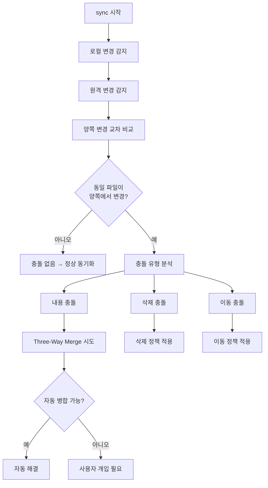
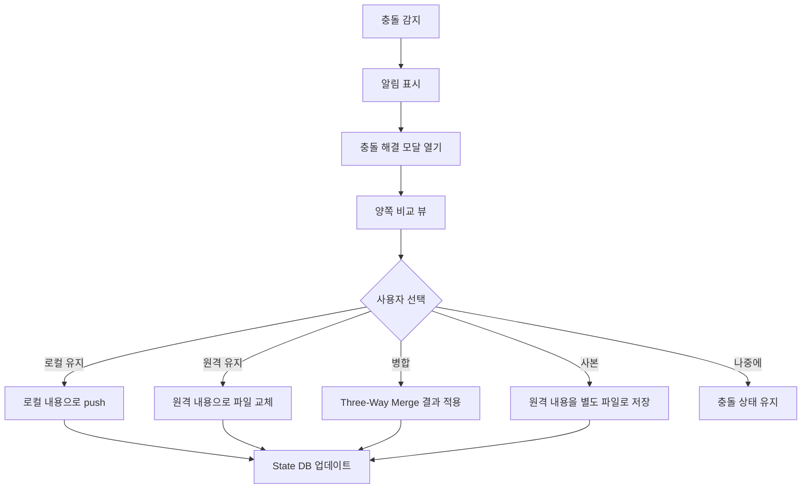

# 충돌 해결 전략

> 작성일: 2026-05-08
> 상태: complete

---

## 개요

충돌은 마지막 동기화 이후 **양쪽 모두** 동일 파일/페이지를 수정했을 때 발생한다.
Im-Nobsidian은 Git의 Three-Way Merge를 차용하여 충돌을 감지하고 해결한다.

---

## 충돌 감지 흐름



---

## 충돌 유형

### 1. 내용 충돌 (Content Conflict)

양쪽에서 동일 파일의 내용을 다르게 수정.

```
Base (마지막 동기화 시점):
  "Hello World"

Local (현재 Obsidian):
  "Hello Korea"

Remote (현재 Notion):
  "Hello Notion"

→ 충돌: 같은 위치를 다르게 수정함
```

### 2. 삭제 충돌 (Delete Conflict)

한쪽에서 삭제하고 다른쪽에서 수정.

```
Case A: 로컬 삭제 + 원격 수정
  → 원격 수정본 유지 (삭제 취소) 또는 사용자 선택

Case B: 원격 삭제 + 로컬 수정
  → 로컬 수정본 유지 또는 사용자 선택
```

### 3. 이동 충돌 (Move Conflict)

양쪽에서 같은 파일을 다른 위치로 이동.

```
Base: /projects/note.md
Local: /archive/note.md
Remote: /work/note.md

→ 충돌: 어디에 둘 것인가
```

### 4. 생성 충돌 (Create Conflict)

양쪽에서 동일 경로에 다른 내용의 파일 생성.

```
Local: /notes/idea.md (내용 A)
Remote: /notes/idea.md (내용 B, 새 페이지)

→ 충돌: 같은 이름 다른 내용
```

---

## Three-Way Merge 알고리즘

### 원리

```
      Base (공통 조상)
      /          \
   Local        Remote
      \          /
       Merged (결과)
```

- **Base**: 마지막 성공 동기화 시점의 스냅샷 (StateDB.base_snapshot)
- **Local**: 현재 로컬 파일 내용
- **Remote**: 현재 Notion 페이지 내용 (MD 변환 후)

### 구현

```typescript
import { diff3Merge } from "node-diff3";

interface MergeResult {
  readonly success: boolean;
  readonly merged: string | null;
  readonly conflicts: MergeConflict[];
}

interface MergeConflict {
  readonly baseStart: number;
  readonly baseEnd: number;
  readonly localLines: string[];
  readonly remoteLines: string[];
}

function threeWayMerge(base: string, local: string, remote: string): MergeResult {
  const baseLines = base.split("\n");
  const localLines = local.split("\n");
  const remoteLines = remote.split("\n");

  const result = diff3Merge(localLines, baseLines, remoteLines);

  const merged: string[] = [];
  const conflicts: MergeConflict[] = [];
  let lineOffset = 0;

  for (const chunk of result) {
    if (chunk.ok) {
      // 양쪽 동일하게 수정했거나 한쪽만 수정 → 자동 병합
      merged.push(...chunk.ok);
      lineOffset += chunk.ok.length;
    } else if (chunk.conflict) {
      // 양쪽 다르게 수정 → 충돌
      conflicts.push({
        baseStart: lineOffset,
        baseEnd: lineOffset + (chunk.conflict.o?.length ?? 0),
        localLines: chunk.conflict.a,
        remoteLines: chunk.conflict.b,
      });
      // 충돌 마커 삽입 (수동 해결용)
      merged.push("<<<<<<< LOCAL");
      merged.push(...chunk.conflict.a);
      merged.push("=======");
      merged.push(...chunk.conflict.b);
      merged.push(">>>>>>> REMOTE");
      lineOffset += chunk.conflict.a.length;
    }
  }

  return {
    success: conflicts.length === 0,
    merged: merged.join("\n"),
    conflicts,
  };
}
```

### 자동 병합 가능 케이스

```
1. 다른 영역 수정:
   - Local: 1~5줄 수정
   - Remote: 20~25줄 수정
   → 자동 병합 성공 (서로 다른 영역)

2. 동일 수정:
   - Local: "typo" → "type"
   - Remote: "typo" → "type" (동일)
   → 자동 병합 성공 (같은 변경)

3. 한쪽만 수정:
   - Local: 수정됨
   - Remote: Base와 동일
   → Local 채택 (충돌 아님)
```

---

## 충돌 해결 정책

### 설정 기반 자동 해결

```typescript
type ConflictStrategy = "local-first" | "remote-first" | "manual" | "duplicate";

function resolveConflict(conflict: Conflict, strategy: ConflictStrategy): Resolution {
  switch (strategy) {
    case "local-first":
      // 항상 로컬 우선
      return { action: "keep-local", content: conflict.localContent };

    case "remote-first":
      // 항상 원격 우선
      return { action: "keep-remote", content: conflict.remoteContent };

    case "manual":
      // 사용자에게 선택 요청
      return { action: "prompt-user", conflict };

    case "duplicate":
      // 양쪽 모두 보존 (사본 생성)
      return {
        action: "duplicate",
        localPath: conflict.path,
        remotePath: appendSuffix(conflict.path, ".notion-conflict"),
      };
  }
}
```

### 수동 해결 UI (CLI)

```
⚠ 충돌 감지: notes/project-plan.md

  로컬 수정 시각: 2026-05-08 14:30:00
  원격 수정 시각: 2026-05-08 14:25:00
  마지막 동기화: 2026-05-08 12:00:00

  변경 요약:
    로컬: +5줄, -2줄 (섹션 3 수정)
    원격: +3줄, -1줄 (섹션 1 수정)

  자동 병합: 가능 (서로 다른 영역)

  선택:
  [1] 자동 병합 적용 (권장)
  [2] 로컬 버전 유지
  [3] 원격 버전 유지
  [4] 양쪽 모두 보존 (사본 생성)
  [5] 편집기에서 직접 해결
```

### 수동 해결 UI (Plugin)



---

## 충돌 해결 상세 시나리오

### 시나리오 1: 다른 섹션 동시 편집

```markdown
<!-- Base (마지막 동기화) -->

# 프로젝트 계획

## 목표

기존 목표

## 일정

기존 일정

## 예산

기존 예산
```

```markdown
<!-- Local (Obsidian에서 수정) -->

# 프로젝트 계획

## 목표

기존 목표

## 일정

**수정된 일정** ← 여기 수정

## 예산

기존 예산
```

```markdown
<!-- Remote (Notion에서 수정) -->

# 프로젝트 계획

## 목표

**새로운 목표** ← 여기 수정

## 일정

기존 일정

## 예산

기존 예산
```

**결과: 자동 병합 성공**

```markdown
# 프로젝트 계획

## 목표

**새로운 목표** ← Remote 반영

## 일정

**수정된 일정** ← Local 반영

## 예산

기존 예산
```

### 시나리오 2: 동일 줄 동시 편집

```markdown
<!-- Base -->

상태: 진행중

<!-- Local -->

상태: 완료

<!-- Remote -->

상태: 보류
```

**결과: 충돌 → 수동 해결 필요**

```markdown
<<<<<<< LOCAL
상태: 완료
=======
상태: 보류

> > > > > > > REMOTE
```

### 시나리오 3: 삭제 vs 수정

```
Local: 파일 삭제
Remote: 동일 파일 내용 수정

정책별 처리:
- local-first: 삭제 확정 → Notion archive
- remote-first: 삭제 취소 → 로컬에 수정본 복원
- manual: 사용자에게 "삭제된 파일이 원격에서 수정됨" 알림
- duplicate: 원격 수정본을 .conflict 파일로 저장
```

### 시나리오 4: Frontmatter 충돌

```yaml
# Base
---
status: draft
tags: [project]
---
# Local
---
status: active # status 변경
tags: [project]
---
# Remote
---
status: draft
tags: [project, important] # tags 변경
---
```

**결과: 자동 병합 성공** (다른 필드 수정)

```yaml
---
status: active # Local 반영
tags: [project, important] # Remote 반영
---
```

---

## Base Snapshot 관리

### 저장 전략

```typescript
// 매 동기화 성공 시 base_snapshot 갱신
async function updateBaseSnapshot(
  stateDb: StateDB,
  record: SyncRecord,
  content: string,
): Promise<void> {
  const compressed = zlib.deflateSync(Buffer.from(content, "utf-8"));

  // 크기 제한 (1MB 이상이면 저장하지 않음 → 충돌 시 전체 파일 비교로 대체)
  if (compressed.length > 1_048_576) {
    stateDb.updateHash(record.id, computeHash(content), null);
    return;
  }

  stateDb.updateHash(record.id, computeHash(content), compressed);
}

// Base 복원
function getBaseContent(record: SyncRecord): string | null {
  if (!record.baseSnapshot) return null;
  return zlib.inflateSync(record.baseSnapshot).toString("utf-8");
}
```

### Base가 없는 경우 (초기 동기화 직후)

```typescript
function handleNoBase(conflict: Conflict): Resolution {
  // Base가 없으면 Three-Way Merge 불가
  // → 파일 전체를 충돌로 간주

  return {
    action: "prompt-user",
    message: "초기 동기화 후 양쪽에서 동시 수정됨. 어느 쪽을 유지할까요?",
    options: ["local", "remote", "duplicate"],
  };
}
```

---

## 충돌 방지 전략

충돌 해결보다 충돌 방지가 더 중요하다.

### 1. 빈번한 동기화

```
자동 동기화 간격: 5분 (기본)
→ 5분 내 양쪽 동시 편집 확률 낮음
→ 간격이 짧을수록 충돌 확률 감소
```

### 2. 파일 잠금 표시

```typescript
// Push 중인 파일에 대해 "잠금" 상태 표시
// 실제 잠금은 불가 (Notion에서 편집 차단 불가)
// 대신 사용자에게 시각적 힌트 제공

interface LockIndicator {
  readonly path: string;
  readonly lockedAt: string;
  readonly lockedBy: "local" | "remote";
  readonly reason: "syncing" | "editing";
}
```

### 3. Notion last_edited_time 활용

```typescript
// Pull 전에 원격 수정 시각 확인
// 마지막 동기화 이후 원격 수정이 없으면 Push 안전
async function canSafelyPush(
  pageId: string,
  lastSyncAt: string,
  client: NotionClient,
): Promise<boolean> {
  const page = await client.getPage(pageId);
  return new Date(page.last_edited_time) <= new Date(lastSyncAt);
}
```

### 4. 영역 분리 컨벤션

```
권장 사용 패턴:
- Obsidian: 작성/편집 위주 (콘텐츠 원본)
- Notion: 읽기/공유 위주 (뷰어)

또는:
- 특정 폴더 push-only (Obsidian → Notion)
- 특정 폴더 pull-only (Notion → Obsidian)
→ 방향 고정으로 충돌 원천 차단
```

---

## 충돌 로그

모든 충돌 이벤트를 로그로 기록 (디버깅 및 분석용).

```typescript
interface ConflictLog {
  readonly timestamp: string;
  readonly path: string;
  readonly type: "content" | "delete" | "move" | "create";
  readonly localModified: string;
  readonly remoteModified: string;
  readonly resolution: "auto-merge" | "local" | "remote" | "duplicate" | "manual";
  readonly autoMergeSuccess: boolean;
  readonly conflictRegions: number;
}

// 저장 위치: .im-nobsidian/conflict-log.jsonl (JSON Lines)
// 자동 정리: 30일 초과 → 삭제
```

---

## 구현 우선순위

| 단계 | 기능                                       | 버전 |
| ---- | ------------------------------------------ | ---- |
| 1    | 충돌 감지 (양쪽 동시 수정 탐지)            | v0.1 |
| 2    | 4가지 정책 (local/remote/manual/duplicate) | v0.1 |
| 3    | Three-Way Merge 자동 병합                  | v0.1 |
| 4    | CLI 수동 해결 UI                           | v0.1 |
| 5    | Plugin 모달 해결 UI                        | v0.2 |
| 6    | Frontmatter 필드별 병합                    | v0.2 |
| 7    | 삭제/이동 충돌 해결                        | v0.2 |
| 8    | 충돌 로그 + 통계                           | v0.3 |
| 9    | 영역 잠금 표시                             | v0.4 |
