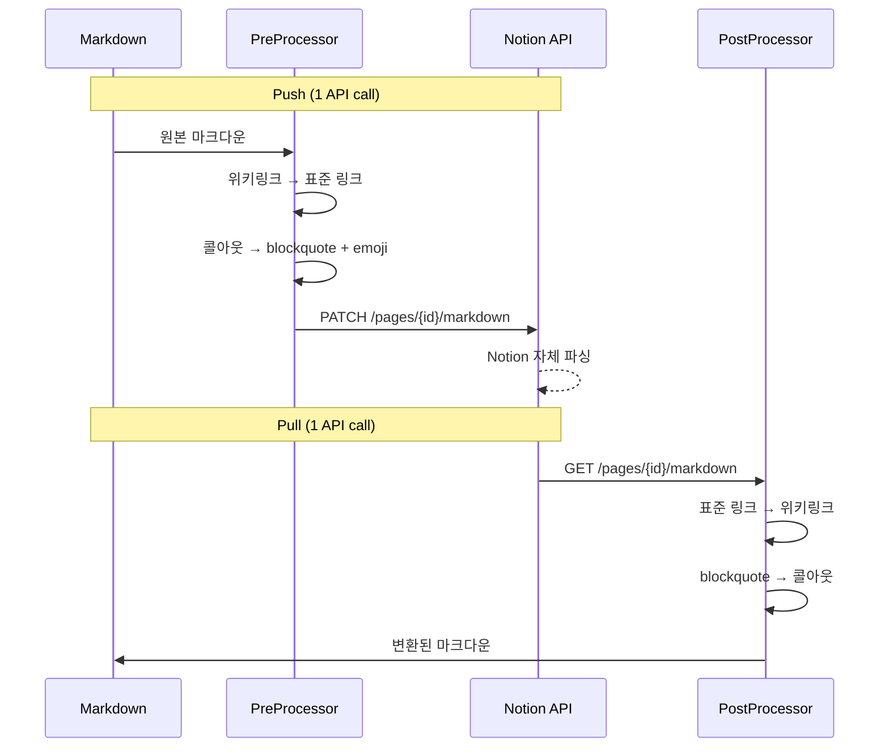
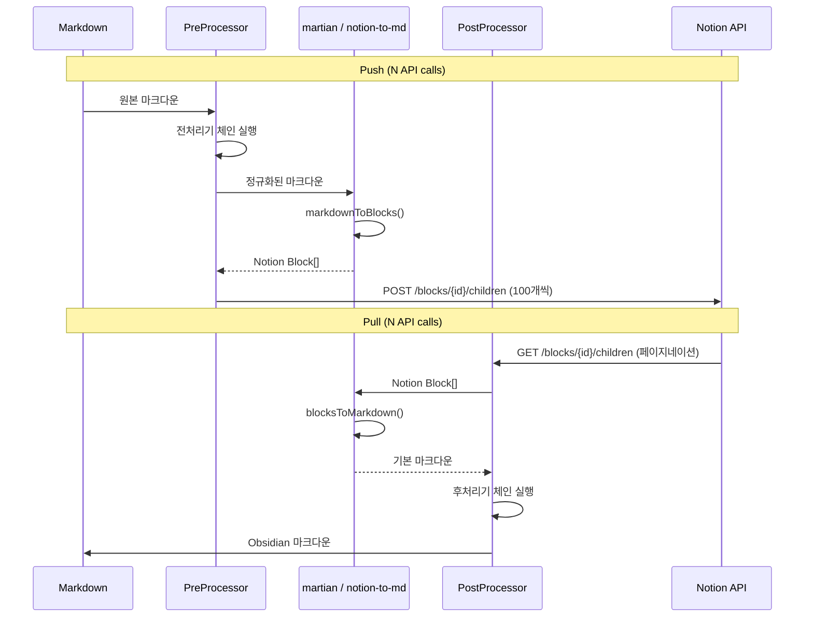
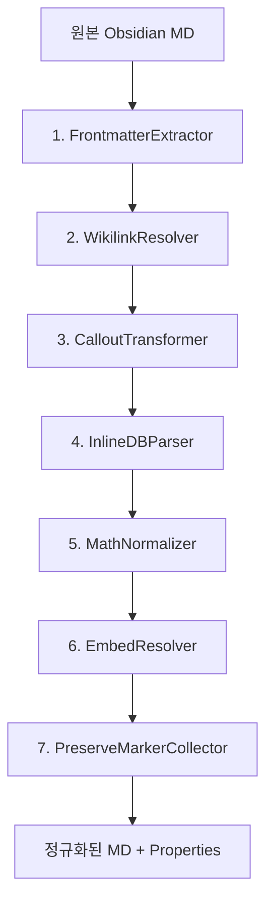
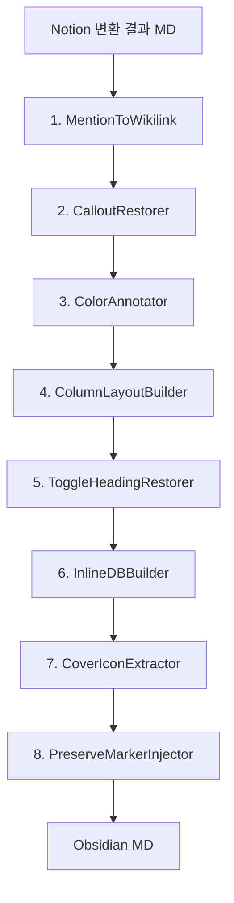

# 변환 파이프라인 설계

> 작성일: 2026-05-08
> 상태: complete

---

## 개요

변환 파이프라인은 Obsidian Markdown ↔ Notion 블록 간 양방향 변환을 담당한다.
핵심 원칙: **라운드트립 안전성** — `MD → Notion → MD` 변환 후 원본과 동일해야 한다.

---

## 파이프라인 구조

```mermaid
flowchart LR
    subgraph Push["Push (MD → Notion)"]
        direction LR
        MD1[Obsidian MD] --> FM[Frontmatter 추출]
        FM --> PRE[전처리기 체인]
        PRE --> ROUTE{경로 선택}
        ROUTE -->|단순 문서| MDAPI[Markdown API]
        ROUTE -->|복합 문서| MARTIAN[@tryfabric/martian]
        MDAPI --> BLOCKS1[Notion Blocks]
        MARTIAN --> BLOCKS1
    end

    subgraph Pull["Pull (Notion → MD)"]
        direction LR
        BLOCKS2[Notion Blocks] --> ROUTE2{경로 선택}
        ROUTE2 -->|단순 문서| MDAPI2[Markdown API]
        ROUTE2 -->|복합 문서| N2MD[notion-to-md]
        MDAPI2 --> POST[후처리기 체인]
        N2MD --> POST
        POST --> FMGEN[Frontmatter 생성]
        FMGEN --> MD2[Obsidian MD]
    end
```

---

## 이중 경로 (Dual Path) 전략

### 경로 선택 기준

```typescript
function selectConversionPath(content: ConversionInput): "markdown-api" | "block-api" {
  // Markdown API 사용 가능 조건 (모두 충족 시)
  const canUseMarkdownApi =
    !content.hasInlineDatabase && // 인라인 DB 없음
    !content.hasColumnLayout && // 컬럼 레이아웃 없음
    !content.hasSyncedBlock && // 동기화 블록 없음
    !content.hasToggleHeading && // 토글 헤딩 없음
    !content.needsColorAnnotation && // 인라인 색상 없음
    !content.hasFileAttachment; // 첨부파일 없음 (이미지 제외)

  return canUseMarkdownApi ? "markdown-api" : "block-api";
}
```

### Markdown API 경로 (Fast Path)



- **장점**: API 1회 호출, 속도 3-5x 빠름, 블록 100개 제한 없음
- **단점**: 고급 기능(색상, 컬럼, 토글 헤딩 등) 미지원

### Block API 경로 (Full Path)



- **장점**: 모든 블록 타입 완벽 지원, 세밀한 제어
- **단점**: 여러 API 호출, 100블록 페이지네이션 필요

---

## 전처리기 체인 (Push: MD → Notion)

전처리기는 순서대로 실행되며, 각 단계의 출력이 다음 단계의 입력이 된다.



### 1. FrontmatterExtractor

YAML frontmatter를 추출하여 Notion Properties로 변환 준비.

```typescript
interface FrontmatterExtractor {
  process(input: ProcessorInput): ProcessorOutput;
}

// 입출력
// input:  "---\ntitle: Hello\nstatus: active\n---\n# Content"
// output: { body: "# Content", properties: { title: "Hello", status: "active" } }
```

**속성 타입 매핑:**

| YAML 타입            | Notion Property 타입               |
| -------------------- | ---------------------------------- |
| `string`             | `title` (첫 번째) 또는 `rich_text` |
| `number`             | `number`                           |
| `boolean`            | `checkbox`                         |
| `date` (ISO 8601)    | `date`                             |
| `string` (URL 패턴)  | `url`                              |
| `string[]`           | `multi_select`                     |
| `string` (enum-like) | `select`                           |
| `[[link]]` 배열      | `relation`                         |

### 2. WikilinkResolver

`[[Page Name]]` → 마크다운 링크 또는 Notion page mention으로 변환.

```typescript
interface WikilinkResolver {
  process(input: ProcessorInput): ProcessorOutput;
}

// 패턴 매칭
const WIKILINK_REGEX = /\[\[([^\]|]+)(?:\|([^\]]+))?\]\]/g;
// [[Page Name]] → 표시: "Page Name"
// [[Page Name|Display]] → 표시: "Display", 링크: "Page Name"

// 변환 전략
// Block API path: → Notion page mention { type: "mention", mention: { page: { id } } }
// Markdown API path: → [Display](notion://page_id) + 후처리로 mention 변환
```

**해결 순서:**

1. `wikilink_map` 테이블에서 title/aliases 정확 매치
2. 파일명(확장자 제외) 매치
3. 경로 끝부분 매치 (`folder/note` → `note`)
4. 미해결 시 텍스트 보존 + 로그 경고

### 3. CalloutTransformer

Obsidian 콜아웃 → Notion callout block 변환.

```typescript
// Obsidian 형식
// > [!warning] Title
// > Content here

// Notion callout block 형식
// { type: "callout", callout: { icon: { emoji: "⚠️" }, color: "yellow_background", rich_text: [...] } }
```

**타입→아이콘/색상 매핑:**

| Obsidian 타입          | Notion 아이콘 | Notion 색상         |
| ---------------------- | ------------- | ------------------- |
| `note`                 | 📝            | `blue_background`   |
| `abstract` / `summary` | 📋            | `blue_background`   |
| `info`                 | ℹ️            | `blue_background`   |
| `tip` / `hint`         | 💡            | `green_background`  |
| `success` / `check`    | ✅            | `green_background`  |
| `question` / `faq`     | ❓            | `yellow_background` |
| `warning` / `caution`  | ⚠️            | `yellow_background` |
| `failure` / `fail`     | ❌            | `red_background`    |
| `danger` / `error`     | 🔥            | `red_background`    |
| `bug`                  | 🐛            | `red_background`    |
| `example`              | 📌            | `purple_background` |
| `quote` / `cite`       | 💬            | `gray_background`   |

**Foldable 처리:**

```
> [!info]+ Expanded by default   → callout (메타: foldable=open)
> [!info]- Collapsed by default  → callout (메타: foldable=closed)
> [!info] Not foldable           → callout (메타: foldable=none)
```

Notion은 foldable 개념이 없으므로, preserve marker로 메타 보존:

```
%% im-nobsidian:callout:foldable=closed %%
```

### 4. InlineDBParser

동일 파일 내 인라인 DB (Notion child_database) → 마크다운 테이블 변환.

```typescript
// Push 방향: 마크다운 테이블 → Notion child_database 블록
// 조건: preserve marker로 감싸진 테이블만 인라인 DB로 인식

// 마크다운 측 표현:
// %% im-nobsidian:inline-db:id=abc123 %%
// | Name | Status | Due |
// |------|--------|-----|
// | Task 1 | Done | 2026-05-01 |
// | Task 2 | WIP | 2026-05-10 |
// %% im-nobsidian:end %%
```

### 5. MathNormalizer

LaTeX 수식 표기 정규화.

```typescript
// Obsidian: $inline$ 또는 $$block$$
// Notion: equation block (block) 또는 inline equation (inline)

// 정규화: $ ... $ → inline equation marker
//         $$ ... $$ → block equation marker
// Notion이 네이티브 equation 블록 제공하므로 직접 매핑
```

### 6. EmbedResolver

Obsidian 임베드 문법 → Notion embed/bookmark/video 블록.

```typescript
// ![[image.png]] → image block (file upload)
// ![[note.md]] → synced block reference 또는 링크
//  → video block
// <iframe src="..."> → embed block
```

### 7. PreserveMarkerCollector

라운드트립 불가능한 정보를 preserve marker에서 수집하여 메타데이터로 분리.

```typescript
const MARKER_REGEX = /%% im-nobsidian:(\w+):(.+?) %%/g;

// 수집된 메타데이터는 변환 결과에 첨부되어
// Notion에 보이지 않는 형태로 저장 (마지막 블록의 caption 또는 별도 필드)
```

---

## 후처리기 체인 (Pull: Notion → MD)

후처리기는 notion-to-md 또는 Markdown API의 출력을 Obsidian 형식으로 변환한다.



### 1. MentionToWikilink

Notion page mention → `[[Page Name]]` 변환.

```typescript
// Notion mention: { type: "mention", mention: { page: { id: "abc123" } } }
// 또는 MD API 결과: [Page Title](notion://abc123)

// 변환: wikilink_map 조회 → [[Page Title]]
// 별칭 있으면: [[Page Name|Display Text]]
```

### 2. CalloutRestorer

Notion callout → Obsidian 콜아웃 구문 복원.

```typescript
// Notion: { type: "callout", callout: { icon: { emoji: "⚠️" }, color: "yellow_background" } }
// → > [!warning] Title
//   > Content

// 아이콘+색상 조합으로 Obsidian 타입 역추론
// preserve marker에서 foldable 상태 복원
```

### 3. ColorAnnotator

Notion 인라인 색상/밑줄 → 보존 마커 변환.

```typescript
// Notion Enhanced MD: <span color="red">텍스트</span>
// → %%im-nobsidian:color:red%%텍스트%%/color%%

// Notion Enhanced MD: <span underline="true">텍스트</span>
// → %%im-nobsidian:underline%%텍스트%%/underline%%

// Push 시 보존 마커 → 원본 <span> 태그로 복원
```

### 4. ColumnLayoutBuilder

Notion column_list → Obsidian 컬럼 표현.

```typescript
// Notion: { type: "column_list", children: [{ type: "column" }, ...] }

// Obsidian 변환 (Multi-Column Markdown 플러그인 호환):
// > [!col]
// > > [!col-md]
// > > Column 1 content
// >
// > > [!col-md]
// > > Column 2 content

// preserve marker로 원본 비율 보존:
// %% im-nobsidian:column:ratio=1:2:1 %%
```

### 5. ToggleHeadingRestorer

Notion toggleable heading → Obsidian 표현 변환.

```typescript
// Notion: { type: "heading_2", heading_2: { is_toggleable: true, children: [...] } }

// Obsidian 변환 (callout 기반):
// > [!toggle] ## Heading Text
// > Toggle content here

// preserve marker:
// %% im-nobsidian:toggle-heading:level=2 %%
```

### 6. InlineDBBuilder

Notion child_database → 마크다운 테이블 변환.

```typescript
// Notion: 페이지 내 child_database 블록 발견 시
// 1. Database 속성 조회
// 2. 모든 Row 조회
// 3. 마크다운 테이블 생성 + preserve marker 감싸기

// 결과:
// %% im-nobsidian:inline-db:id=abc123&title=Tasks %%
// | Name | Status | Due |
// |------|--------|-----|
// | Task 1 | Done | 2026-05-01 |
// %% im-nobsidian:end %%
```

### 7. CoverIconExtractor

Notion 페이지 커버/아이콘 → frontmatter 변환.

```typescript
// Notion: { cover: { external: { url: "..." } }, icon: { emoji: "🚀" } }

// Frontmatter:
// ---
// cover: attachments/cover-abc123.png
// icon: "🚀"
// ---
```

### 8. PreserveMarkerInjector

라운드트립 불가능 정보를 preserve marker로 삽입.

```typescript
// 구문: %% im-nobsidian:{type}:{key=value&...} %%
// Obsidian에서 %% ... %%는 주석 처리되어 렌더링되지 않음

// 예시:
// %% im-nobsidian:callout:foldable=closed %%
// %% im-nobsidian:color:red_background %%
// %% im-nobsidian:column:ratio=1:2 %%
// %% im-nobsidian:toggle-heading:level=3 %%
// %% im-nobsidian:inline-db:id=abc123&title=Tasks %%
// %% im-nobsidian:synced-block:id=xyz789 %%
// %% im-nobsidian:end %%
```

---

## Preserve Marker 시스템

### 설계 원칙

1. Obsidian 주석 문법(`%% ... %%`) 사용 → 렌더링에 영향 없음
2. 정규식으로 쉽게 파싱 가능한 구조적 형식
3. 중첩 불가 — 각 마커는 독립적
4. `end` 마커로 범위 종료 (범위형에만 사용)

### 마커 타입 분류

| 타입             | 형태  | 설명                      |
| ---------------- | ----- | ------------------------- |
| `callout`        | point | 콜아웃 foldable 상태      |
| `color`          | range | 인라인 색상 범위          |
| `underline`      | range | 밑줄 텍스트 범위          |
| `unknown`        | point | Notion 전용 블록 보존     |
| `column`         | point | 컬럼 비율 메타데이터      |
| `toggle-heading` | point | 토글 헤딩 레벨            |
| `inline-db`      | range | 인라인 DB 시작~끝         |
| `synced-block`   | range | 동기화 블록 (읽기전용)    |
| `embed`          | point | 임베드 원본 URL           |
| `cover`          | point | 커버 이미지 Notion URL    |
| `formula`        | range | Notion 수식 (변환 불가분) |

### Point 마커 vs Range 마커

```markdown
<!-- Point: 바로 다음 요소에 대한 메타 -->

%% im-nobsidian:callout:foldable=closed %%

> [!info]- Collapsed Section
> This is hidden by default

<!-- Range: 시작~끝 사이 콘텐츠에 적용 -->

%% im-nobsidian:inline-db:id=abc123&title=Projects %%
| Name | Status |
|------|--------|
| A | Done |
%% im-nobsidian:end %%
```

---

## Properties ↔ Frontmatter 매핑

### Push (Frontmatter → Notion Properties)

```typescript
function mapFrontmatterToProperties(
  frontmatter: Record<string, unknown>,
  dbSchema: DatabaseSchema | null,
): NotionProperties {
  const properties: NotionProperties = {};

  for (const [key, value] of Object.entries(frontmatter)) {
    // 예약 키 스킵
    if (["cover", "icon", "aliases"].includes(key)) continue;

    const propType =
      dbSchema?.properties.find((p) => p.obsidian_key === key)?.type ?? inferPropertyType(value);

    switch (propType) {
      case "title":
        properties[key] = { title: [{ text: { content: String(value) } }] };
        break;
      case "rich_text":
        properties[key] = { rich_text: [{ text: { content: String(value) } }] };
        break;
      case "number":
        properties[key] = { number: Number(value) };
        break;
      case "checkbox":
        properties[key] = { checkbox: Boolean(value) };
        break;
      case "date":
        properties[key] = { date: { start: String(value) } };
        break;
      case "url":
        properties[key] = { url: String(value) };
        break;
      case "select":
        properties[key] = { select: { name: String(value) } };
        break;
      case "multi_select":
        properties[key] = {
          multi_select: (value as string[]).map((v) => ({ name: v })),
        };
        break;
      case "relation":
        properties[key] = {
          relation: (value as string[])
            .map((link) => {
              const pageId = resolveWikilink(link);
              return { id: pageId };
            })
            .filter(Boolean),
        };
        break;
    }
  }
  return properties;
}
```

### Pull (Notion Properties → Frontmatter)

```typescript
function mapPropertiesToFrontmatter(properties: NotionProperties): Record<string, unknown> {
  const frontmatter: Record<string, unknown> = {};

  for (const [key, prop] of Object.entries(properties)) {
    switch (prop.type) {
      case "title":
        frontmatter[key] = extractPlainText(prop.title);
        break;
      case "rich_text":
        frontmatter[key] = extractPlainText(prop.rich_text);
        break;
      case "number":
        frontmatter[key] = prop.number;
        break;
      case "checkbox":
        frontmatter[key] = prop.checkbox;
        break;
      case "date":
        frontmatter[key] = prop.date?.start ?? null;
        break;
      case "url":
        frontmatter[key] = prop.url;
        break;
      case "select":
        frontmatter[key] = prop.select?.name ?? null;
        break;
      case "multi_select":
        frontmatter[key] = prop.multi_select.map((s) => s.name);
        break;
      case "relation":
        frontmatter[key] = prop.relation.map((r) => {
          const entry = resolvePageId(r.id);
          return entry ? `[[${entry.title}]]` : r.id;
        });
        break;
      case "people":
        frontmatter[key] = prop.people.map((p) => p.name);
        break;
      case "files":
        frontmatter[key] = prop.files.map((f) => f.name ?? f.external?.url ?? f.file?.url);
        break;
      case "formula":
        frontmatter[key] = extractFormulaValue(prop.formula);
        break;
      case "rollup":
        frontmatter[key] = extractRollupValue(prop.rollup);
        break;
    }
  }
  return frontmatter;
}
```

---

## 변환 등급별 처리 경로

### A등급 (Perfect) — 직접 변환

라이브러리가 네이티브 지원. 전/후처리 불필요.

```
heading, paragraph, list (ordered/unordered/todo),
quote, divider, link, bold, italic, strikethrough,
inline code, code block, image (URL)
```

### B등급 (Alternative) — 전/후처리기 필요

변환 가능하지만 대안적 표현 사용.

```
callout ↔ callout block (아이콘/색상 매핑)
wikilink ↔ page mention (매핑 테이블 조회)
frontmatter ↔ properties (타입 변환)
LaTeX ↔ equation block (구문 정규화)
embed ↔ embed/video/bookmark block (URL 분석)
```

### DB등급 (Database) — 구조적 변환

Database 특화 매핑 로직.

```
Full-page DB → 폴더 + _schema.yml + row .md 파일
Inline DB → preserve marker + 마크다운 테이블
Relation → [[위키링크]] 배열
Rollup → 캐시된 값 (읽기전용 표시)
Formula → 캐시된 값 (읽기전용 표시)
Views → Dataview/Kanban/Calendar 플러그인 파일
```

### C등급 (Preserved) — Preserve Marker 사용

1:1 매핑 불가. 마커로 원본 정보 보존.

```
인라인 색상 → <span class="notion-*"> + 마커
컬럼 레이아웃 → [!col] callout + 마커
토글 헤딩 → [!toggle] callout + 마커
Synced Block → 인용 + 마커 (읽기전용)
```

---

## 블록 100개 페이지네이션

Notion API는 한 번에 최대 100개 블록만 추가 가능.

```typescript
async function appendBlocksInBatches(
  pageId: string,
  blocks: NotionBlock[],
  client: NotionClient,
): Promise<void> {
  const BATCH_SIZE = 100;

  for (let i = 0; i < blocks.length; i += BATCH_SIZE) {
    const batch = blocks.slice(i, i + BATCH_SIZE);
    await client.appendChildren(pageId, batch);
  }
}

async function fetchAllBlocks(blockId: string, client: NotionClient): Promise<NotionBlock[]> {
  const blocks: NotionBlock[] = [];
  let cursor: string | undefined;

  do {
    const response = await client.listChildren(blockId, { start_cursor: cursor });
    blocks.push(...response.results);
    cursor = response.next_cursor ?? undefined;
  } while (cursor);

  // 재귀: has_children인 블록의 하위 블록도 가져오기
  for (const block of blocks) {
    if (block.has_children) {
      block.children = await fetchAllBlocks(block.id, client);
    }
  }

  return blocks;
}
```

---

## Rich Text 2000자 제한

Notion rich_text 배열의 단일 text 객체는 2000자까지만 허용.

```typescript
function splitRichText(text: string): RichTextItem[] {
  const MAX_LENGTH = 2000;
  const items: RichTextItem[] = [];

  for (let i = 0; i < text.length; i += MAX_LENGTH) {
    items.push({
      type: "text",
      text: { content: text.slice(i, i + MAX_LENGTH) },
    });
  }

  return items;
}
```

`@tryfabric/martian`이 이 분할을 자동 처리하지만, 커스텀 블록 생성 시 직접 분할 필요.

---

## Pipeline 클래스 구조

```typescript
interface Processor {
  readonly name: string;
  readonly order: number;
  process(input: ProcessorInput): ProcessorOutput;
}

interface ProcessorInput {
  readonly content: string;
  readonly metadata: ProcessorMetadata;
  readonly context: ConversionContext;
}

interface ProcessorOutput {
  readonly content: string;
  readonly metadata: ProcessorMetadata;
}

interface ConversionContext {
  readonly direction: "push" | "pull";
  readonly path: "markdown-api" | "block-api";
  readonly stateDb: StateDB;
  readonly config: Config;
}

class ConversionPipeline {
  private readonly preProcessors: Processor[];
  private readonly postProcessors: Processor[];

  convertToNotion(markdown: string, context: ConversionContext): ConversionResult {
    let input: ProcessorInput = {
      content: markdown,
      metadata: {},
      context,
    };

    // 전처리기 체인 실행 (order 순)
    for (const processor of this.preProcessors) {
      const output = processor.process(input);
      input = { ...input, content: output.content, metadata: output.metadata };
    }

    // 라이브러리 변환
    const blocks =
      context.path === "markdown-api"
        ? this.convertViaMarkdownApi(input.content)
        : markdownToBlocks(input.content);

    return { blocks, properties: input.metadata.properties ?? {} };
  }

  convertToMarkdown(blocks: NotionBlock[], context: ConversionContext): string {
    // 라이브러리 변환
    const rawMarkdown =
      context.path === "markdown-api"
        ? this.fetchViaMarkdownApi(context)
        : blocksToMarkdown(blocks);

    let input: ProcessorInput = {
      content: rawMarkdown,
      metadata: { blocks },
      context,
    };

    // 후처리기 체인 실행 (order 순)
    for (const processor of this.postProcessors) {
      const output = processor.process(input);
      input = { ...input, content: output.content, metadata: output.metadata };
    }

    return input.content;
  }
}
```

---

## 라운드트립 테스트 전략

```typescript
// 모든 A/B등급 기능에 대해:
// 1. 원본 MD 준비
// 2. Push: MD → Notion Blocks
// 3. Pull: Notion Blocks → MD
// 4. 원본 === 결과 검증

describe("roundtrip", () => {
  test.each(fixtures)("$name", async ({ input }) => {
    const blocks = pipeline.convertToNotion(input, pushContext);
    const output = pipeline.convertToMarkdown(blocks, pullContext);
    expect(normalize(output)).toBe(normalize(input));
  });
});

// normalize: 무의미한 차이 제거 (trailing whitespace, 빈 줄 수 등)
function normalize(md: string): string {
  return md
    .replace(/\r\n/g, "\n")
    .replace(/[ \t]+$/gm, "")
    .replace(/\n{3,}/g, "\n\n")
    .trim();
}
```

---

## 에러 처리

```typescript
class ConversionError extends Error {
  constructor(
    message: string,
    readonly processor: string,
    readonly input: string,
    readonly cause?: Error,
  ) {
    super(`[${processor}] ${message}`);
  }
}

// 파이프라인 내 에러 정책:
// 1. 개별 전/후처리기 실패 → 해당 단계 스킵 + 경고 로그
// 2. 라이브러리 변환 실패 → ConversionError throw
// 3. API 호출 실패 → pending_operations에 큐잉
```
