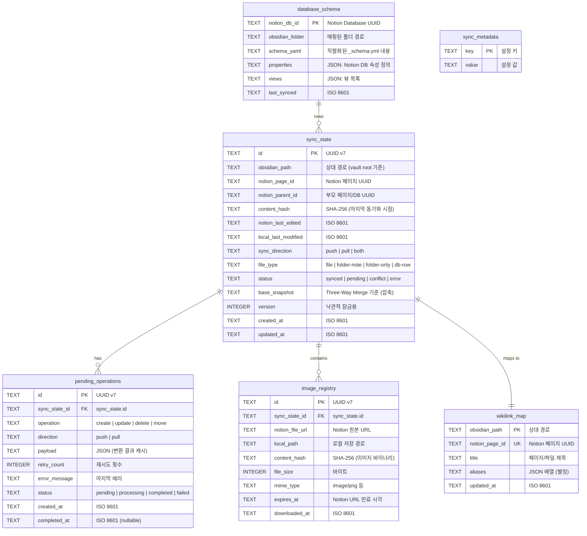

# 데이터 모델

> 작성일: 2026-05-08
> 상태: complete

---

## 개요

Im-Nobsidian은 동기화 상태를 로컬 SQLite 데이터베이스(`.im-nobsidian/sync.db`)에 영속 저장한다.
이 문서는 모든 테이블 스키마, 인덱스, 관계, 그리고 런타임 데이터 구조를 정의한다.

---

## ER 다이어그램



---

## 테이블 상세

### 1. sync_state — 동기화 상태 (핵심 테이블)

파일/페이지 단위로 동기화 상태를 추적하는 메인 테이블.

```sql
CREATE TABLE sync_state (
    id              TEXT PRIMARY KEY,
    obsidian_path   TEXT NOT NULL,
    notion_page_id  TEXT,
    notion_parent_id TEXT,
    content_hash    TEXT NOT NULL,
    notion_last_edited TEXT,
    local_last_modified TEXT NOT NULL,
    sync_direction  TEXT NOT NULL DEFAULT 'both',
    file_type       TEXT NOT NULL DEFAULT 'file',
    status          TEXT NOT NULL DEFAULT 'pending',
    base_snapshot   BLOB,
    version         INTEGER NOT NULL DEFAULT 1,
    created_at      TEXT NOT NULL DEFAULT (datetime('now')),
    updated_at      TEXT NOT NULL DEFAULT (datetime('now')),

    CONSTRAINT chk_sync_direction CHECK (sync_direction IN ('push', 'pull', 'both')),
    CONSTRAINT chk_file_type CHECK (file_type IN ('file', 'folder-note', 'folder-only', 'db-row')),
    CONSTRAINT chk_status CHECK (status IN ('synced', 'pending', 'conflict', 'error'))
);

CREATE UNIQUE INDEX idx_sync_state_path ON sync_state(obsidian_path);
CREATE UNIQUE INDEX idx_sync_state_notion ON sync_state(notion_page_id) WHERE notion_page_id IS NOT NULL;
CREATE INDEX idx_sync_state_status ON sync_state(status);
CREATE INDEX idx_sync_state_parent ON sync_state(notion_parent_id);
CREATE INDEX idx_sync_state_updated ON sync_state(updated_at);
```

**필드 설명:**

| 필드             | 설명                                                 |
| ---------------- | ---------------------------------------------------- |
| `id`             | UUID v7 (시간순 정렬 가능)                           |
| `obsidian_path`  | Vault 루트 기준 상대 경로. `/` 구분자                |
| `notion_page_id` | Notion에 아직 안 올라간 파일은 NULL                  |
| `content_hash`   | 마지막 동기화 성공 시점의 SHA-256. 변경 감지 기준    |
| `base_snapshot`  | 충돌 해결을 위한 기준 스냅샷 (zlib 압축). 최대 1MB   |
| `version`        | 낙관적 동시성 제어. UPDATE 시 WHERE version = ? 조건 |

### 2. wikilink_map — 위키링크 매핑

`[[Page Name]]` 텍스트를 Notion page_id로 양방향 변환하기 위한 조회 테이블.

```sql
CREATE TABLE wikilink_map (
    obsidian_path   TEXT PRIMARY KEY,
    notion_page_id  TEXT NOT NULL UNIQUE,
    title           TEXT NOT NULL,
    aliases         TEXT DEFAULT '[]',
    updated_at      TEXT NOT NULL DEFAULT (datetime('now'))
);

CREATE INDEX idx_wikilink_title ON wikilink_map(title);
CREATE INDEX idx_wikilink_notion ON wikilink_map(notion_page_id);
```

**조회 패턴:**

```typescript
// Push: [[Page Name]] → notion page_id
function resolveWikilink(linkText: string): string | null {
  // 1순위: title 정확 매치
  // 2순위: aliases JSON 배열 내 매치
  // 3순위: obsidian_path 파일명 부분 매치
}

// Pull: notion page mention → [[Page Name]]
function resolvePageMention(pageId: string): string {
  // notion_page_id로 조회 → title 반환
  // 미등록 시 Notion API로 제목 조회 후 등록
}
```

### 3. pending_operations — 대기 작업 큐

네트워크 오류, rate limit 등으로 실패한 작업을 재시도하기 위한 큐.

```sql
CREATE TABLE pending_operations (
    id              TEXT PRIMARY KEY,
    sync_state_id   TEXT NOT NULL REFERENCES sync_state(id) ON DELETE CASCADE,
    operation       TEXT NOT NULL,
    direction       TEXT NOT NULL,
    payload         TEXT,
    retry_count     INTEGER NOT NULL DEFAULT 0,
    error_message   TEXT,
    status          TEXT NOT NULL DEFAULT 'pending',
    created_at      TEXT NOT NULL DEFAULT (datetime('now')),
    completed_at    TEXT,

    CONSTRAINT chk_operation CHECK (operation IN ('create', 'update', 'delete', 'move')),
    CONSTRAINT chk_direction CHECK (direction IN ('push', 'pull')),
    CONSTRAINT chk_op_status CHECK (status IN ('pending', 'processing', 'completed', 'failed'))
);

CREATE INDEX idx_pending_status ON pending_operations(status, created_at);
CREATE INDEX idx_pending_sync ON pending_operations(sync_state_id);
```

**재시도 정책:**

| retry_count | 대기 시간     | 비고            |
| ----------- | ------------- | --------------- |
| 0           | 즉시          | 첫 시도         |
| 1           | 5초           |                 |
| 2           | 30초          |                 |
| 3           | 2분           |                 |
| 4           | 10분          |                 |
| 5+          | 포기 → failed | 사용자에게 알림 |

### 4. database_schema — Notion DB 스키마 캐시

Full-page Database를 폴더로 매핑할 때 스키마 정보를 저장.

```sql
CREATE TABLE database_schema (
    notion_db_id    TEXT PRIMARY KEY,
    obsidian_folder TEXT NOT NULL UNIQUE,
    schema_yaml     TEXT NOT NULL,
    properties      TEXT NOT NULL,
    views           TEXT DEFAULT '[]',
    last_synced     TEXT NOT NULL DEFAULT (datetime('now'))
);

CREATE INDEX idx_db_folder ON database_schema(obsidian_folder);
```

**`_schema.yml` 구조:**

```yaml
# projects/_schema.yml — Notion DB "Projects" 매핑 정보
notion_db_id: "abc123..."
title_property: "Name"
properties:
  - name: "Name"
    type: "title"
    obsidian_key: "title"
  - name: "Status"
    type: "select"
    obsidian_key: "status"
    options: ["Not Started", "In Progress", "Done"]
  - name: "Due Date"
    type: "date"
    obsidian_key: "due_date"
  - name: "Assignee"
    type: "people"
    obsidian_key: "assignee"
    format: "name_only"
  - name: "Priority"
    type: "number"
    obsidian_key: "priority"
  - name: "Tags"
    type: "multi_select"
    obsidian_key: "tags"
  - name: "Related"
    type: "relation"
    obsidian_key: "related"
    target_db: "Tasks"
    format: "wikilink"
views:
  - name: "All"
    type: "table"
    obsidian_plugin: "dataview"
  - name: "Board"
    type: "board"
    obsidian_plugin: "kanban"
sort:
  - property: "Due Date"
    direction: "ascending"
filter: null
```

### 5. image_registry — 이미지 관리

Notion의 pre-signed URL은 1시간 후 만료. 다운로드된 이미지를 추적.

```sql
CREATE TABLE image_registry (
    id              TEXT PRIMARY KEY,
    sync_state_id   TEXT NOT NULL REFERENCES sync_state(id) ON DELETE CASCADE,
    notion_file_url TEXT NOT NULL,
    local_path      TEXT NOT NULL,
    content_hash    TEXT NOT NULL,
    file_size       INTEGER NOT NULL,
    mime_type       TEXT NOT NULL,
    expires_at      TEXT,
    downloaded_at   TEXT NOT NULL DEFAULT (datetime('now'))
);

CREATE UNIQUE INDEX idx_image_hash ON image_registry(content_hash);
CREATE INDEX idx_image_sync ON image_registry(sync_state_id);
CREATE INDEX idx_image_local ON image_registry(local_path);
```

**이미지 처리 전략:**

```
Pull 시:
1. 블록에서 이미지 URL 추출
2. content_hash로 이미 다운로드 여부 확인 (중복 방지)
3. 미존재 시 즉시 다운로드 (URL 만료 전)
4. attachments/ 폴더에 저장, MD에 상대 경로 삽입
5. image_registry에 등록

Push 시:
1. MD에서 이미지 경로 추출
2. content_hash 비교로 업로드 필요 여부 확인
3. 변경 시 Notion File Upload API 호출
4. 반환된 Notion URL 저장
```

### 6. sync_metadata — 메타데이터 KV 스토어

동기화 전역 설정 및 상태를 저장하는 간단한 키-값 스토어.

```sql
CREATE TABLE sync_metadata (
    key     TEXT PRIMARY KEY,
    value   TEXT NOT NULL
);
```

**저장 항목:**

| key              | 예시 value                  | 설명                            |
| ---------------- | --------------------------- | ------------------------------- |
| `last_sync_at`   | `2026-05-08T14:30:00Z`      | 마지막 동기화 완료 시각         |
| `last_push_at`   | `2026-05-08T14:30:00Z`      | 마지막 push 시각                |
| `last_pull_at`   | `2026-05-08T14:25:00Z`      | 마지막 pull 시각                |
| `root_page_id`   | `abc123...`                 | Notion 루트 페이지 ID           |
| `workspace_id`   | `def456...`                 | Notion 워크스페이스 ID          |
| `schema_version` | `1`                         | DB 스키마 버전 (마이그레이션용) |
| `db_backup_path` | `.im-nobsidian/sync.db.bak` | 최근 백업 경로                  |

---

## 런타임 타입 정의

```typescript
// sync_state 레코드
interface SyncRecord {
  readonly id: string;
  readonly obsidianPath: string;
  readonly notionPageId: string | null;
  readonly notionParentId: string | null;
  readonly contentHash: string;
  readonly notionLastEdited: string | null;
  readonly localLastModified: string;
  readonly syncDirection: "push" | "pull" | "both";
  readonly fileType: "file" | "folder-note" | "folder-only" | "db-row";
  readonly status: "synced" | "pending" | "conflict" | "error";
  readonly baseSnapshot: Buffer | null;
  readonly version: number;
  readonly createdAt: string;
  readonly updatedAt: string;
}

// 변경 감지 결과
interface ChangeDetectionResult {
  readonly localChanges: LocalChange[];
  readonly remoteChanges: RemoteChange[];
  readonly conflicts: Conflict[];
}

interface LocalChange {
  readonly path: string;
  readonly type: "created" | "modified" | "deleted" | "moved";
  readonly currentHash: string;
  readonly previousHash: string | null;
  readonly movedFrom?: string;
}

interface RemoteChange {
  readonly pageId: string;
  readonly type: "created" | "modified" | "deleted" | "moved";
  readonly lastEdited: string;
  readonly previousEdited: string | null;
  readonly movedFromParent?: string;
}

interface Conflict {
  readonly syncRecord: SyncRecord;
  readonly localChange: LocalChange;
  readonly remoteChange: RemoteChange;
  readonly baseContent: string;
  readonly localContent: string;
  readonly remoteContent: string;
}

// 위키링크 조회
interface WikilinkEntry {
  readonly obsidianPath: string;
  readonly notionPageId: string;
  readonly title: string;
  readonly aliases: readonly string[];
}

// 대기 작업
interface PendingOperation {
  readonly id: string;
  readonly syncStateId: string;
  readonly operation: "create" | "update" | "delete" | "move";
  readonly direction: "push" | "pull";
  readonly payload: unknown;
  readonly retryCount: number;
  readonly errorMessage: string | null;
  readonly status: "pending" | "processing" | "completed" | "failed";
  readonly createdAt: string;
  readonly completedAt: string | null;
}
```

---

## 데이터 접근 패턴

### StateDB 클래스 API

```typescript
class StateDB {
  // 초기화
  static open(dbPath: string): StateDB;
  migrate(): void;
  close(): void;
  backup(): string; // 백업 경로 반환

  // sync_state CRUD
  getByPath(path: string): SyncRecord | null;
  getByNotionId(pageId: string): SyncRecord | null;
  getByStatus(status: SyncRecord["status"]): SyncRecord[];
  getByParent(parentId: string): SyncRecord[];
  getAll(): SyncRecord[];
  upsert(record: Omit<SyncRecord, "id" | "createdAt" | "updatedAt">): SyncRecord;
  updateStatus(id: string, status: SyncRecord["status"]): void;
  updateHash(id: string, hash: string, snapshot?: Buffer): void;
  delete(id: string): void;

  // wikilink_map
  resolveWikilink(text: string): WikilinkEntry | null;
  resolvePageId(pageId: string): WikilinkEntry | null;
  upsertWikilink(entry: WikilinkEntry): void;
  getAllWikilinks(): WikilinkEntry[];

  // pending_operations
  enqueue(op: Omit<PendingOperation, "id" | "createdAt" | "completedAt">): string;
  dequeue(count: number): PendingOperation[];
  markCompleted(id: string): void;
  markFailed(id: string, error: string): void;
  getPendingCount(): number;
  getFailedOperations(): PendingOperation[];
  clearCompleted(): number;

  // database_schema
  getDbSchema(notionDbId: string): DatabaseSchema | null;
  upsertDbSchema(schema: DatabaseSchema): void;

  // image_registry
  findImageByHash(hash: string): ImageRecord | null;
  registerImage(record: ImageRecord): void;
  getImagesByPage(syncStateId: string): ImageRecord[];

  // sync_metadata
  getMeta(key: string): string | null;
  setMeta(key: string, value: string): void;

  // 트랜잭션
  transaction<T>(fn: () => T): T;
}
```

### 주요 쿼리 패턴

```sql
-- 변경 감지: 로컬 파일 해시가 저장된 해시와 다른 것
SELECT * FROM sync_state
WHERE status = 'synced'
  AND content_hash != :currentHash;

-- 충돌 파일 목록
SELECT * FROM sync_state WHERE status = 'conflict';

-- 특정 폴더 하위 모든 파일
SELECT * FROM sync_state
WHERE obsidian_path LIKE :folderPath || '/%';

-- 재시도 대상 작업 (exponential backoff)
SELECT * FROM pending_operations
WHERE status = 'pending'
  AND retry_count < 5
  AND created_at < datetime('now', '-' || (5 * power(2, retry_count)) || ' seconds')
ORDER BY created_at ASC
LIMIT :batchSize;

-- 고아 레코드 정리 (로컬에도 Notion에도 없는 것)
DELETE FROM sync_state
WHERE notion_page_id IS NULL
  AND obsidian_path NOT IN (:existingPaths);
```

---

## 마이그레이션 전략

```typescript
const MIGRATIONS: Migration[] = [
  {
    version: 1,
    description: "초기 스키마",
    up: `
      CREATE TABLE sync_state (...);
      CREATE TABLE wikilink_map (...);
      CREATE TABLE pending_operations (...);
      CREATE TABLE database_schema (...);
      CREATE TABLE image_registry (...);
      CREATE TABLE sync_metadata (...);
      INSERT INTO sync_metadata (key, value) VALUES ('schema_version', '1');
    `,
  },
  // 향후 마이그레이션 추가
];

// 실행 로직
function migrate(db: Database): void {
  const currentVersion = Number(
    db.prepare("SELECT value FROM sync_metadata WHERE key = 'schema_version'").get()?.value ?? 0,
  );
  for (const migration of MIGRATIONS) {
    if (migration.version > currentVersion) {
      db.exec(migration.up);
      db.prepare("UPDATE sync_metadata SET value = ? WHERE key = 'schema_version'").run(
        String(migration.version),
      );
    }
  }
}
```

---

## 백업 정책

```
매 동기화 시작 전:
1. sync.db → sync.db.bak (이전 백업 덮어쓰기)
2. sync_metadata.db_backup_path 업데이트

크래시 복구:
1. sync.db 무결성 검사 (PRAGMA integrity_check)
2. 실패 시 sync.db.bak에서 복원
3. pending_operations에서 'processing' → 'pending'으로 복구
4. 누락된 sync_state는 full scan으로 재구축
```

---

## 성능 고려사항

| 항목          | 설계 결정                                                   |
| ------------- | ----------------------------------------------------------- |
| DB 크기       | ~1KB/파일. 10,000 파일 = ~10MB                              |
| WAL 모드      | `PRAGMA journal_mode = WAL` (읽기/쓰기 동시 허용)           |
| 배치 삽입     | 트랜잭션 내에서 100건씩 bulk insert                         |
| 인덱스        | 조회 빈도 높은 path, page_id, status에 집중                 |
| base_snapshot | zlib 압축으로 저장. 100KB 문서 → ~30KB                      |
| 캐시          | prepared statement 캐싱 (better-sqlite3 기본 지원)          |
| 동시 접근     | Plugin 환경에서 단일 프로세스 보장 (Obsidian 단일 인스턴스) |

---

## 설정 파일 구조

### `.im-nobsidian/config.json`

```typescript
import { z } from "zod";

const ConfigSchema = z.object({
  version: z.literal(1),
  notion: z.object({
    token: z.string().startsWith("ntn_"),
    rootPageId: z.string().uuid(),
    workspaceId: z.string().uuid().optional(),
  }),
  sync: z.object({
    direction: z.enum(["push", "pull", "both"]).default("both"),
    conflictStrategy: z
      .enum(["local-first", "remote-first", "manual", "duplicate"])
      .default("manual"),
    autoSync: z.boolean().default(false),
    autoSyncInterval: z.number().min(30).max(3600).default(300),
    deleteSync: z.boolean().default(false),
  }),
  paths: z.object({
    include: z.array(z.string()).default(["**/*"]),
    exclude: z.array(z.string()).default([]),
    attachments: z.string().default("attachments"),
    dbSchemas: z.string().default("_schemas"),
  }),
  conversion: z.object({
    preferMarkdownApi: z.boolean().default(true),
    preserveMarkers: z.boolean().default(true),
    frontmatterMapping: z.boolean().default(true),
    imageDownload: z.enum(["immediate", "lazy", "skip"]).default("immediate"),
  }),
  advanced: z.object({
    concurrency: z.number().min(1).max(10).default(3),
    maxRetries: z.number().min(0).max(10).default(5),
    timeoutMs: z.number().min(5000).max(60000).default(30000),
    batchSize: z.number().min(1).max(100).default(100),
    snapshotMaxSize: z.number().default(1048576),
  }),
});

type Config = z.infer<typeof ConfigSchema>;
```

### `.im-nobsidian/ignore`

```gitignore
# gitignore 문법 동일
.obsidian/
templates/
_private/
*.excalidraw.md
daily-notes/
```
