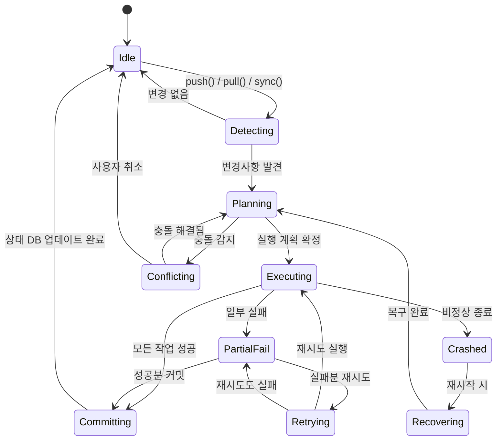
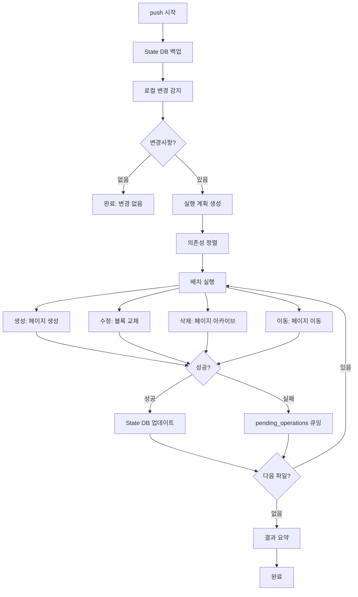
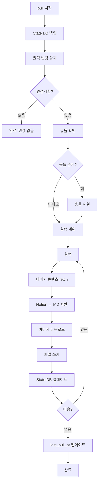
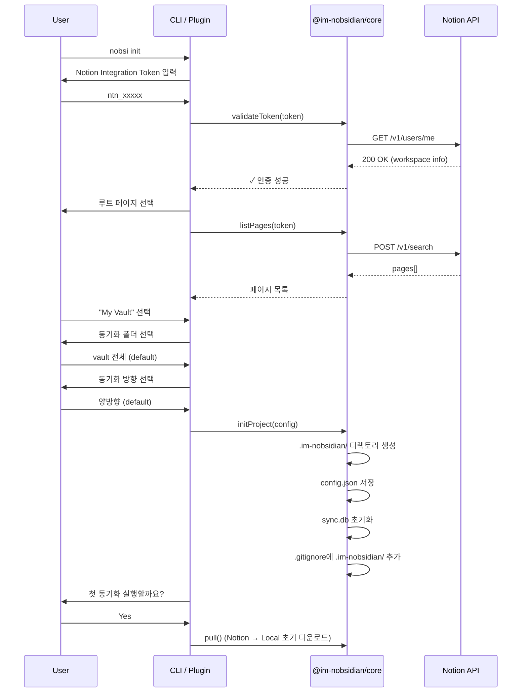

# 동기화 엔진 설계

> 작성일: 2026-05-08
> 상태: complete

---

## 개요

동기화 엔진은 Im-Nobsidian의 핵심으로, Obsidian Vault와 Notion 워크스페이스 간의 상태를 일치시킨다.
Git의 pull/push 모델을 차용하되, 실시간이 아닌 **명시적 트리거** 기반으로 동작한다.

---

## 동기화 상태 머신



---

## 변경 감지 알고리즘

### 로컬 변경 감지 (Push 방향)

```typescript
async function detectLocalChanges(
  vault: VaultFS,
  stateDb: StateDB,
  config: Config,
): Promise<LocalChange[]> {
  const changes: LocalChange[] = [];
  const syncedRecords = stateDb.getByStatus("synced");
  const existingPaths = new Set<string>();

  // 1. 현재 Vault 파일 스캔
  const currentFiles = await vault.listFiles("/");
  const filteredFiles = applyIgnoreRules(currentFiles, config.paths);

  for (const file of filteredFiles) {
    existingPaths.add(file.path);
    const currentHash = await vault.getHash(file.path);
    const record = stateDb.getByPath(file.path);

    if (!record) {
      // 새 파일
      changes.push({
        path: file.path,
        type: "created",
        currentHash,
        previousHash: null,
      });
    } else if (record.contentHash !== currentHash) {
      // 수정된 파일
      changes.push({
        path: file.path,
        type: "modified",
        currentHash,
        previousHash: record.contentHash,
      });
    }
    // 동일 → skip
  }

  // 2. 삭제 감지: DB에 있지만 Vault에 없는 파일
  for (const record of syncedRecords) {
    if (!existingPaths.has(record.obsidianPath)) {
      changes.push({
        path: record.obsidianPath,
        type: "deleted",
        currentHash: "",
        previousHash: record.contentHash,
      });
    }
  }

  // 3. 이동 감지: 동일 해시 + 삭제+생성 쌍
  const created = changes.filter((c) => c.type === "created");
  const deleted = changes.filter((c) => c.type === "deleted");

  for (const del of deleted) {
    const match = created.find((c) => c.currentHash === del.previousHash);
    if (match) {
      // 이동으로 재분류
      changes.splice(changes.indexOf(del), 1);
      changes.splice(changes.indexOf(match), 1);
      changes.push({
        path: match.path,
        type: "moved",
        currentHash: match.currentHash,
        previousHash: del.previousHash,
        movedFrom: del.path,
      });
    }
  }

  return changes;
}
```

### 원격 변경 감지 (Pull 방향)

```typescript
async function detectRemoteChanges(
  client: NotionClient,
  stateDb: StateDB,
  rootPageId: string,
): Promise<RemoteChange[]> {
  const changes: RemoteChange[] = [];
  const lastPullAt = stateDb.getMeta("last_pull_at");

  // 1. 마지막 pull 이후 수정된 페이지 목록 조회
  // Notion search API: filter by last_edited_time > lastPullAt
  const modifiedPages = await client.searchModifiedPages({
    editedAfter: lastPullAt,
    ancestorId: rootPageId,
  });

  for (const page of modifiedPages) {
    const record = stateDb.getByNotionId(page.id);

    if (!record) {
      // Notion에서 새로 생성된 페이지
      changes.push({
        pageId: page.id,
        type: "created",
        lastEdited: page.last_edited_time,
        previousEdited: null,
      });
    } else if (record.notionLastEdited !== page.last_edited_time) {
      // 수정된 페이지
      changes.push({
        pageId: page.id,
        type: "modified",
        lastEdited: page.last_edited_time,
        previousEdited: record.notionLastEdited,
      });
    }
  }

  // 2. 삭제 감지: DB에 있지만 Notion에서 archived/deleted된 것
  // Notion API는 archived 상태를 반환하므로 이를 활용
  const syncedWithNotion = stateDb.getAll().filter((r) => r.notionPageId);
  for (const record of syncedWithNotion) {
    try {
      const page = await client.getPage(record.notionPageId!);
      if (page.archived) {
        changes.push({
          pageId: record.notionPageId!,
          type: "deleted",
          lastEdited: page.last_edited_time,
          previousEdited: record.notionLastEdited,
        });
      }
    } catch (error) {
      if (isNotFoundError(error)) {
        changes.push({
          pageId: record.notionPageId!,
          type: "deleted",
          lastEdited: "",
          previousEdited: record.notionLastEdited,
        });
      }
    }
  }

  // 3. 이동 감지: parent_id 변경
  for (const page of modifiedPages) {
    const record = stateDb.getByNotionId(page.id);
    if (record && record.notionParentId !== page.parent.page_id) {
      changes.push({
        pageId: page.id,
        type: "moved",
        lastEdited: page.last_edited_time,
        previousEdited: record.notionLastEdited,
        movedFromParent: record.notionParentId ?? undefined,
      });
    }
  }

  return changes;
}
```

---

## 동기화 작업 흐름

### Push 흐름



### Pull 흐름



### Sync (양방향) 흐름

```typescript
async function sync(options: SyncOptions): Promise<SyncResult> {
  // 1. Pull 먼저 (원격 변경 → 로컬 반영)
  const pullResult = await this.pull(options);

  // 2. Push (로컬 변경 → 원격 반영)
  // Pull로 인한 로컬 변경은 push 대상에서 제외
  const pushResult = await this.push({
    ...options,
    excludePaths: pullResult.writtenPaths,
  });

  return {
    pull: pullResult,
    push: pushResult,
    conflicts: pullResult.conflicts,
  };
}
```

**Pull-first 이유:**

- 원격 변경을 먼저 반영해야 충돌을 정확하게 감지 가능
- Push 시 원격이 더 최신인 것을 덮어쓰는 사고 방지
- Git의 "fetch + merge → push" 패턴과 동일

---

## 의존성 정렬 (토폴로지컬 소트)

페이지 생성 시 부모가 먼저 존재해야 하므로, 트리 깊이 순으로 실행.

```typescript
function sortByDependency(changes: LocalChange[], stateDb: StateDB): LocalChange[] {
  // 1. 생성 작업: 부모 → 자식 순
  // 2. 삭제 작업: 자식 → 부모 순 (역순)
  // 3. 수정/이동: 순서 무관

  const creates = changes.filter((c) => c.type === "created");
  const deletes = changes.filter((c) => c.type === "deleted");
  const others = changes.filter((c) => c.type !== "created" && c.type !== "deleted");

  // 경로 깊이 기준 정렬
  const sortedCreates = creates.sort((a, b) => a.path.split("/").length - b.path.split("/").length);
  const sortedDeletes = deletes.sort((a, b) => b.path.split("/").length - a.path.split("/").length);

  return [...sortedCreates, ...others, ...sortedDeletes];
}
```

---

## 배치 처리

### 동시성 제어

```typescript
import { Sema } from "async-sema";

const rateLimiter = new Sema(3); // Notion: 3 req/s 제한

async function executeBatch(operations: Operation[], client: NotionClient): Promise<BatchResult> {
  const results: OperationResult[] = [];

  // 동시 3개까지만 실행
  await Promise.all(
    operations.map(async (op) => {
      await rateLimiter.acquire();
      try {
        const result = await executeOperation(op, client);
        results.push(result);
      } finally {
        rateLimiter.release();
      }
    }),
  );

  return { results };
}
```

### Bulk API 활용 (v0.5+)

```typescript
// Notion Bulk Operations API (2026-02)
// 100 페이지 일괄 업데이트 가능
async function bulkUpdate(pages: PageUpdate[], client: NotionClient): Promise<BulkResult> {
  const BULK_BATCH_SIZE = 100;

  for (let i = 0; i < pages.length; i += BULK_BATCH_SIZE) {
    const batch = pages.slice(i, i + BULK_BATCH_SIZE);
    await client.bulkUpdatePages(batch);
  }
}
```

---

## 증분 동기화 (Delta Sync)

전체 파일을 매번 스캔하지 않고, 변경된 것만 처리.

### 전략

```
1차: SHA-256 해시 비교 (빠름, 정확)
  - 파일 읽기 → hash 계산 → DB의 content_hash와 비교
  - 불일치 → 변경됨

2차: mtime 최적화 (대규모 vault용)
  - 파일 mtime이 DB의 local_last_modified 이전 → 변경 없음 (해시 스킵)
  - mtime이 이후 → 해시 계산 진행
  - mtime은 신뢰도 낮으므로 (git checkout 등) 최종 판단은 해시

3차: Watcher 이벤트 (Plugin 자동 동기화용)
  - vault.on('modify', ...) 이벤트로 변경 파일만 추적
  - 디바운스 (2초) 후 해시 확인 → push
```

### 성능 목표

| Vault 크기  | 해시 비교 시간 | mtime 최적화 시 |
| ----------- | -------------- | --------------- |
| 100 파일    | ~100ms         | ~20ms           |
| 1,000 파일  | ~1s            | ~200ms          |
| 10,000 파일 | ~10s           | ~2s             |

---

## 페이지 업데이트 전략

Notion은 "블록 in-place 수정"이 아닌, **전체 교체** 방식을 사용해야 한다.

```typescript
async function updatePageContent(
  pageId: string,
  newBlocks: NotionBlock[],
  client: NotionClient,
): Promise<void> {
  // 1. 기존 블록 전체 삭제
  const existingBlocks = await client.listChildren(pageId);
  for (const block of existingBlocks.results) {
    await client.deleteBlock(block.id);
  }

  // 2. 새 블록 추가 (100개씩 배치)
  await appendBlocksInBatches(pageId, newBlocks, client);
}
```

**대안: 차이점만 업데이트 (v0.3+ 최적화)**

```typescript
// 블록 단위 diff → 최소 API 호출
async function smartUpdate(
  pageId: string,
  oldBlocks: NotionBlock[],
  newBlocks: NotionBlock[],
  client: NotionClient,
): Promise<void> {
  const diff = computeBlockDiff(oldBlocks, newBlocks);

  for (const op of diff) {
    switch (op.type) {
      case "keep":
        break;
      case "add":
        await client.appendAfter(op.afterId, op.block);
        break;
      case "update":
        await client.updateBlock(op.blockId, op.block);
        break;
      case "delete":
        await client.deleteBlock(op.blockId);
        break;
      case "move":
        await client.moveBlock(op.blockId, op.newParent, op.afterId);
        break;
    }
  }
}
```

---

## TreeMapper — 폴더 구조 동기화

### Notion → Obsidian 구조 매핑 규칙

```typescript
interface PageNode {
  readonly id: string;
  readonly title: string;
  readonly hasContent: boolean; // blocks.length > 0
  readonly hasChildren: boolean; // child pages 존재
  readonly isDatabase: boolean; // type === 'child_database'
  readonly parent: PageNode | null;
}

function mapPageToFileSystem(page: PageNode): MappingResult {
  if (page.isDatabase) {
    // Full-page Database → 폴더
    return {
      type: "database-folder",
      path: `${parentPath}/${sanitize(page.title)}/`,
      schemaPath: `${parentPath}/${sanitize(page.title)}/_schema.yml`,
    };
  }

  if (page.hasContent && page.hasChildren) {
    // 콘텐츠 + 하위 페이지 모두 있음 → 폴더 노트
    return {
      type: "folder-note",
      folderPath: `${parentPath}/${sanitize(page.title)}/`,
      notePath: `${parentPath}/${sanitize(page.title)}/${sanitize(page.title)}.md`,
    };
  }

  if (!page.hasContent && page.hasChildren) {
    // 콘텐츠 없이 하위 페이지만 → 빈 폴더
    return {
      type: "folder-only",
      folderPath: `${parentPath}/${sanitize(page.title)}/`,
    };
  }

  // 콘텐츠만 있음 → 일반 파일
  return {
    type: "file",
    path: `${parentPath}/${sanitize(page.title)}.md`,
  };
}
```

### Obsidian → Notion 구조 매핑 규칙

```typescript
function mapFileSystemToPage(entry: FileSystemEntry): PageMapping {
  if (entry.isDirectory) {
    const folderNote = findFolderNote(entry);

    if (folderNote) {
      // 폴더 노트 있음 → 콘텐츠 있는 페이지 + 하위 페이지
      return {
        type: "page-with-children",
        contentSource: folderNote.path,
        children: entry.children.filter((c) => c.path !== folderNote.path),
      };
    }

    // 폴더 노트 없음 → 빈 페이지 + 하위 페이지
    return {
      type: "empty-page-with-children",
      children: entry.children,
    };
  }

  // 일반 파일 → 리프 페이지
  return {
    type: "leaf-page",
    contentSource: entry.path,
  };
}

function findFolderNote(dir: FileSystemEntry): FileSystemEntry | null {
  // 폴더명과 동일한 이름의 .md 파일 찾기
  const folderName = path.basename(dir.path);
  return dir.children.find((c) => c.name === `${folderName}.md` || c.name === `index.md`) ?? null;
}
```

### 파일명 안전화 (Sanitize)

```typescript
function sanitize(title: string): string {
  return title
    .replace(/[<>:"/\\|?*]/g, "_") // 파일시스템 금지 문자
    .replace(/\.+$/g, "") // 끝 마침표 제거
    .replace(/^\s+|\s+$/g, "") // 앞뒤 공백
    .slice(0, 200); // 길이 제한
}
```

---

## 삭제 동기화

### 안전 삭제 정책

```typescript
interface DeletePolicy {
  // 기본: 양쪽 삭제 동기화 비활성 (안전)
  readonly enabled: boolean;
  // true 시: 로컬 삭제 → Notion archive (복원 가능)
  readonly notionAction: "archive" | "delete";
  // true 시: Notion 삭제 → 로컬 .trash/ 이동 (복원 가능)
  readonly localAction: "trash" | "delete";
}
```

**기본 동작 (deleteSync: false):**

- 한쪽에서 삭제해도 다른쪽에 영향 없음
- State DB에서만 레코드 제거
- 다음 sync 시 "새 파일"로 다시 생성될 수 있음 → 사용자에게 경고

**활성화 시 (deleteSync: true):**

- Push 삭제: Notion 페이지 archive (영구 삭제 아님)
- Pull 삭제: 로컬 파일을 `.im-nobsidian/trash/` 이동
- 30일 후 trash 자동 정리 (설정 가능)

---

## 자동 동기화 (Plugin)

### 이벤트 기반 동기화

```typescript
class AutoSyncManager {
  private readonly debounceMs = 2000;
  private readonly pendingFiles = new Set<string>();
  private debounceTimer: NodeJS.Timeout | null = null;

  start(vault: Vault, config: Config): void {
    // 파일 수정 감지
    vault.on("modify", (file) => {
      if (this.shouldSync(file.path, config)) {
        this.pendingFiles.add(file.path);
        this.scheduleSync();
      }
    });

    // 파일 삭제 감지
    vault.on("delete", (file) => {
      if (config.sync.deleteSync) {
        this.pendingFiles.add(file.path);
        this.scheduleSync();
      }
    });

    // 파일 이름변경 감지
    vault.on("rename", (file, oldPath) => {
      this.pendingFiles.add(file.path);
      this.scheduleSync();
    });

    // 주기적 Pull (원격 변경 확인)
    this.startPeriodicPull(config.sync.autoSyncInterval);
  }

  private scheduleSync(): void {
    if (this.debounceTimer) clearTimeout(this.debounceTimer);
    this.debounceTimer = setTimeout(() => {
      this.executePush([...this.pendingFiles]);
      this.pendingFiles.clear();
    }, this.debounceMs);
  }

  private startPeriodicPull(intervalSec: number): void {
    setInterval(() => {
      this.executePull();
    }, intervalSec * 1000);
  }
}
```

### 동기화 상태 표시 (Plugin UI)

```
상태바: ✓ 동기화 완료 (3분 전)
       ↑ Push 중... (2/5)
       ↓ Pull 중... (1/3)
       ⚠ 충돌 2건 (클릭하여 해결)
       ✕ 오류 (클릭하여 상세)
```

---

## 에러 처리 & 복구

### 에러 분류

| 에러 유형                   | 대응                        | 재시도             |
| --------------------------- | --------------------------- | ------------------ |
| Rate Limit (429)            | 백오프 후 재시도            | 즉시 (지수 백오프) |
| Network Timeout             | 대기 후 재시도              | 5초, 30초, 2분     |
| Auth Error (401)            | 사용자에게 토큰 갱신 요청   | 없음               |
| Not Found (404)             | State DB 정리 (고아 레코드) | 없음               |
| Validation Error (400)      | 로그 + 건너뛰기             | 없음               |
| Conflict (409)              | 충돌 해결 흐름 진입         | 없음               |
| Internal Server Error (500) | 대기 후 재시도              | 30초, 2분, 10분    |
| 파일 I/O 에러               | 로그 + 건너뛰기             | 없음               |
| DB 무결성 에러              | 백업에서 복원               | 없음               |

### 크래시 복구

```typescript
async function recoverFromCrash(stateDb: StateDB): Promise<void> {
  // 1. DB 무결성 검사
  const integrity = stateDb.exec("PRAGMA integrity_check");
  if (integrity !== "ok") {
    await restoreFromBackup(stateDb);
    return;
  }

  // 2. 중단된 작업 복구
  // processing 상태 → pending으로 되돌리기
  stateDb.exec(`
    UPDATE pending_operations
    SET status = 'pending', retry_count = retry_count + 1
    WHERE status = 'processing'
  `);

  // 3. 불일치 상태 정리
  // sync_state가 'pending'인데 pending_operations가 없는 경우
  const orphanPending = stateDb.exec(`
    SELECT id FROM sync_state
    WHERE status = 'pending'
    AND id NOT IN (SELECT sync_state_id FROM pending_operations WHERE status = 'pending')
  `);
  for (const record of orphanPending) {
    stateDb.updateStatus(record.id, "synced");
  }
}
```

---

## 초기 설정 (Init) 흐름



---

## 성능 최적화

### API 호출 최소화

| 전략              | 설명                           | 효과                        |
| ----------------- | ------------------------------ | --------------------------- |
| Markdown API 우선 | 1회 호출로 전체 페이지 get/set | API 호출 80% 감소           |
| 변경 감지         | 미변경 파일 skip               | 무변경 시 0 호출            |
| 배치 삽입         | 100블록씩 묶어서 전송          | 큰 파일도 최소 호출         |
| 병렬 처리         | 3 req/s 내에서 동시 실행       | 처리 시간 단축              |
| 이미지 캐시       | SHA-256 중복 방지              | 동일 이미지 재다운로드 방지 |
| mtime 프리필터    | 파일 수정시간으로 사전 필터    | 해시 계산 70% 감소          |

### 대규모 Vault 처리

```
1,000 파일 Vault:
- 변경 감지: ~1초 (mtime 최적화 시 ~200ms)
- 100 파일 push: ~3분 (3 req/s × 평균 2회/파일)
- 100 파일 pull: ~2분 (Markdown API 사용 시)

10,000 파일 Vault:
- 변경 감지: ~10초 (mtime 최적화 시 ~2초)
- 전체 초기 동기화: 고려하지 않음 (점진적 동기화 권장)
- 증분 동기화: 변경 파일 수에만 비례
```

---

## Notion API 호출 패턴

### Rate Limiter 구현

```typescript
import { Sema } from "async-sema";

class RateLimitedClient {
  private readonly sema: Sema;
  private readonly backoffMs = 1000;

  constructor(concurrency: number = 3) {
    this.sema = new Sema(concurrency);
  }

  async request<T>(fn: () => Promise<T>): Promise<T> {
    await this.sema.acquire();
    try {
      return await this.executeWithRetry(fn);
    } finally {
      this.sema.release();
    }
  }

  private async executeWithRetry<T>(fn: () => Promise<T>, attempt: number = 0): Promise<T> {
    try {
      return await fn();
    } catch (error) {
      if (isRateLimited(error) && attempt < 5) {
        const retryAfter = extractRetryAfter(error) ?? this.backoffMs * Math.pow(2, attempt);
        await sleep(retryAfter);
        return this.executeWithRetry(fn, attempt + 1);
      }
      throw error;
    }
  }
}
```

### API 호출 빈도 예산

```
Free Plan: 10,000 req/month
→ ~333 req/day
→ ~42 req/hour (연속 사용 시)

단일 파일 push (Block API): ~3-5 calls
  - 1 createPage/updatePage
  - 1 deleteChildren
  - 1-3 appendChildren (블록 수에 따라)

단일 파일 push (Markdown API): 1 call
  - 1 PATCH /pages/{id}/markdown

단일 파일 pull: 1-3 calls
  - 1 GET page
  - 0-2 listChildren (페이지네이션)

Free Plan으로 하루 가능한 작업:
- Markdown API: ~333 파일 동기화
- Block API: ~66-111 파일 동기화
```
