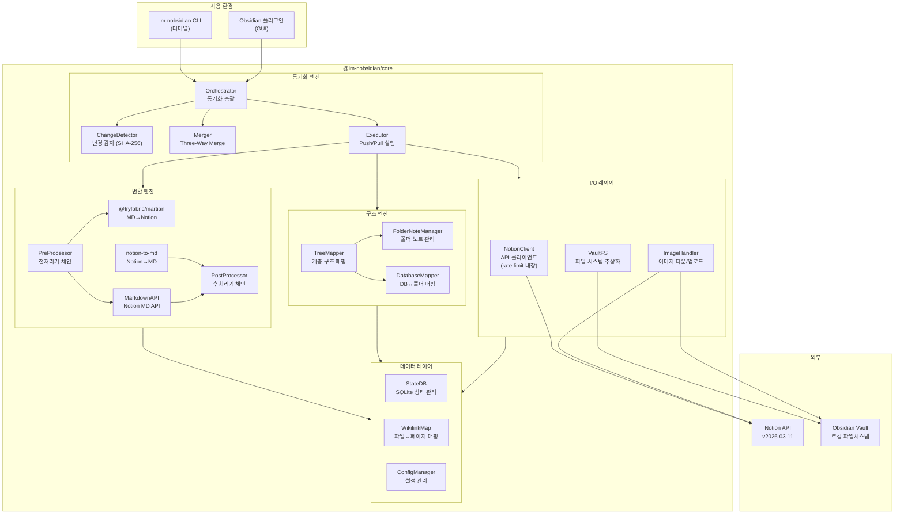
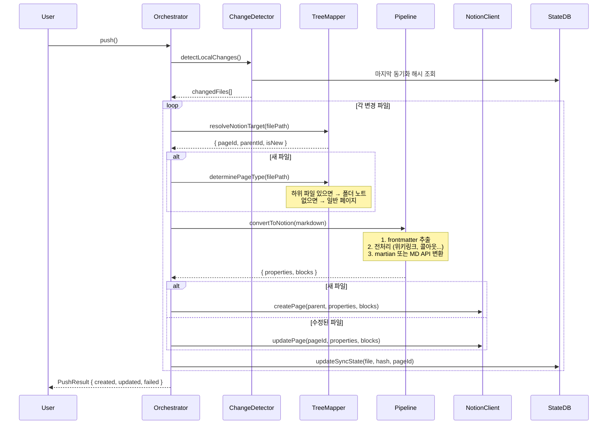
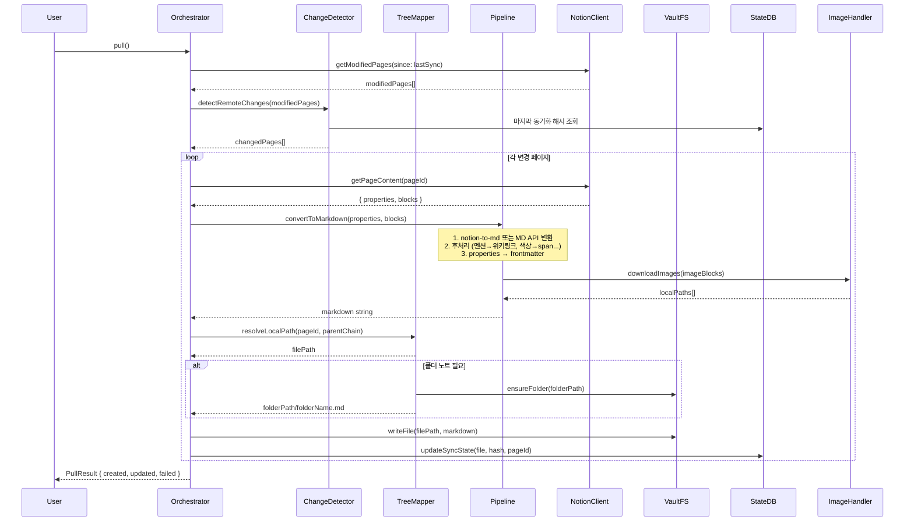
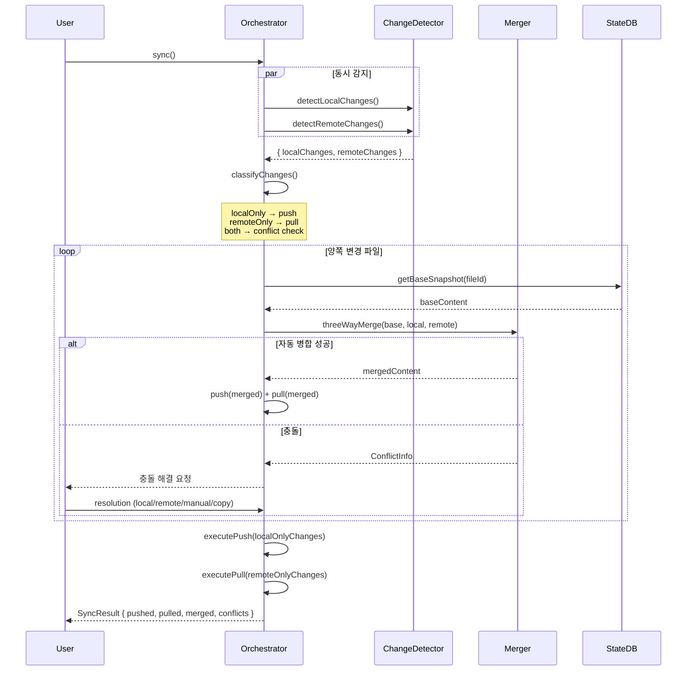
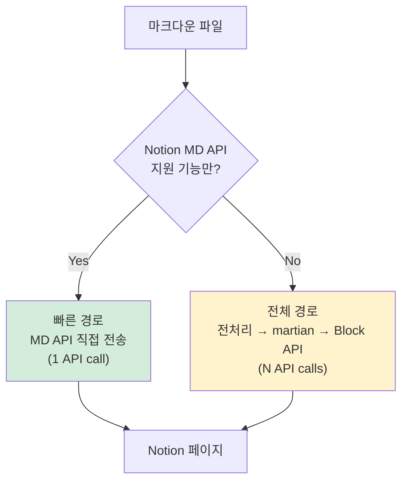
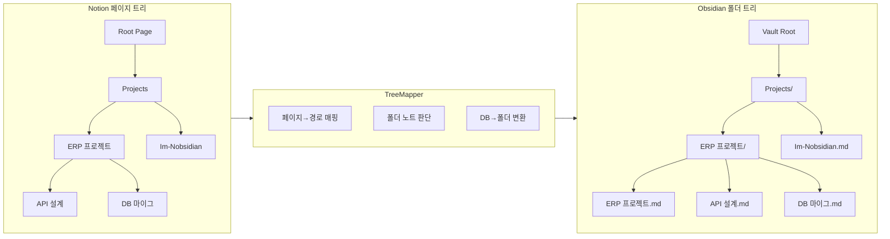
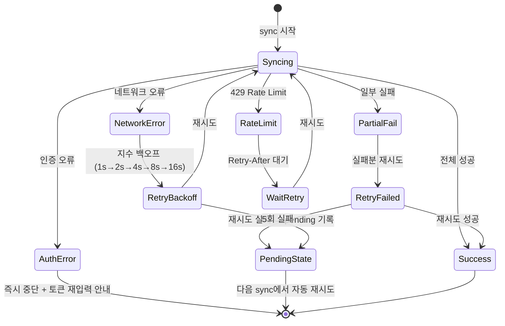

# 시스템 아키텍처

> 작성일: 2026-05-08
> 상태: complete

---

## 전체 시스템 구조



---

## 패키지 구조

```
packages/
├── core/                           ← @im-nobsidian/core (핵심 엔진)
│   └── src/
│       ├── index.ts                ← 공개 API export
│       │
│       ├── sync/                   ← 동기화 엔진
│       │   ├── orchestrator.ts     ← 동기화 총괄 (init/push/pull/sync)
│       │   ├── change-detector.ts  ← SHA-256 기반 변경 감지
│       │   ├── executor.ts         ← Push/Pull 실행
│       │   └── merger.ts           ← Three-Way Merge
│       │
│       ├── convert/                ← 변환 엔진
│       │   ├── pipeline.ts         ← 변환 파이프라인 오케스트레이션
│       │   ├── pre-processors/     ← 전처리기 체인
│       │   │   ├── wikilink.ts     ← [[링크]] → 마크다운 링크
│       │   │   ├── callout.ts      ← [!type] → 이모지/HTML
│       │   │   ├── frontmatter.ts  ← YAML → Properties 준비
│       │   │   └── inline-db.ts    ← 인라인 DB 테이블 파싱
│       │   ├── post-processors/    ← 후처리기 체인
│       │   │   ├── mention.ts      ← page mention → [[링크]]
│       │   │   ├── callout.ts      ← callout block → [!type]
│       │   │   ├── color.ts        ← annotation color → span class
│       │   │   ├── column.ts       ← column_list → [!col] callout
│       │   │   ├── toggle.ts       ← toggleable heading → [!toggle]
│       │   │   ├── cover.ts        ← cover/icon → frontmatter
│       │   │   └── inline-db.ts    ← child_database → 마크다운 테이블
│       │   └── markdown-api.ts     ← Notion Markdown API 래퍼
│       │
│       ├── structure/              ← 구조 엔진
│       │   ├── tree-mapper.ts      ← Notion 페이지 트리 ↔ 폴더 트리
│       │   ├── folder-note.ts      ← 폴더 노트 생성/감지
│       │   ├── db-mapper.ts        ← Database ↔ 폴더 매핑
│       │   └── path-resolver.ts    ← 경로 해석 (이동/이름변경)
│       │
│       ├── data/                   ← 데이터 레이어
│       │   ├── state-db.ts         ← SQLite 동기화 상태
│       │   ├── wikilink-map.ts     ← 파일↔페이지 매핑 테이블
│       │   ├── config.ts           ← 설정 스키마 (zod)
│       │   └── schema-store.ts     ← DB _schema.yml 관리
│       │
│       ├── io/                     ← I/O 레이어
│       │   ├── notion-client.ts    ← Notion API 클라이언트 (rate limit)
│       │   ├── vault-fs.ts         ← 파일시스템 추상화
│       │   └── image-handler.ts    ← 이미지 업/다운로드
│       │
│       └── types/                  ← 공유 타입
│           ├── notion.ts           ← Notion API 타입 확장
│           ├── sync.ts             ← 동기화 상태 타입
│           ├── convert.ts          ← 변환 관련 타입
│           └── config.ts           ← 설정 타입
│
├── cli/                            ← nobsi (CLI 도구)
│   └── src/
│       ├── index.ts                ← 진입점 (#!/usr/bin/env node)
│       ├── commands/
│       │   ├── init.ts             ← nobsi init
│       │   ├── push.ts             ← nobsi push
│       │   ├── pull.ts             ← nobsi pull
│       │   ├── sync.ts             ← nobsi sync
│       │   ├── status.ts           ← nobsi status
│       │   └── diff.ts             ← nobsi diff
│       └── ui/
│           ├── prompts.ts          ← inquirer 대화형 입력
│           ├── progress.ts         ← ora 진행률 표시
│           └── table.ts            ← cli-table3 테이블 출력
│
└── obsidian-plugin/                ← obsidian-im-nobsidian (플러그인)
    └── src/
        ├── main.ts                 ← Plugin 클래스
        ├── settings.ts             ← PluginSettingTab
        ├── sync-manager.ts         ← 자동 동기화 관리
        ├── ui/
        │   ├── status-bar.ts       ← 하단 상태바
        │   ├── sync-modal.ts       ← 충돌 해결 모달
        │   └── progress-notice.ts  ← 동기화 진행 알림
        └── vault-adapter.ts        ← Obsidian Vault API → VaultFS 어댑터
```

---

## 데이터 흐름

### Push (Obsidian → Notion)



### Pull (Notion → Obsidian)



### Sync (양방향)



---

## 핵심 인터페이스

### Orchestrator (동기화 총괄)

```typescript
interface SyncOrchestrator {
  init(config: InitConfig): Promise<void>;
  push(options?: PushOptions): Promise<PushResult>;
  pull(options?: PullOptions): Promise<PullResult>;
  sync(options?: SyncOptions): Promise<SyncResult>;
  status(): Promise<StatusResult>;
}

interface PushOptions {
  files?: string[]; // 특정 파일만 push
  dryRun?: boolean; // 실제 전송 없이 시뮬레이션
  force?: boolean; // 충돌 무시, 덮어쓰기
}

interface SyncResult {
  pushed: FileResult[];
  pulled: FileResult[];
  merged: FileResult[];
  conflicts: ConflictInfo[];
  errors: SyncError[];
  duration: number;
}
```

### VaultFS (파일시스템 추상화)

```typescript
interface VaultFS {
  readFile(path: string): Promise<string>;
  writeFile(path: string, content: string): Promise<void>;
  deleteFile(path: string): Promise<void>;
  moveFile(from: string, to: string): Promise<void>;
  listFiles(folder: string): Promise<FileInfo[]>;
  exists(path: string): Promise<boolean>;
  ensureFolder(path: string): Promise<void>;
  getHash(path: string): Promise<string>; // SHA-256
  watchChanges(callback: ChangeCallback): void; // chokidar
}
```

이 인터페이스를 CLI에서는 Node.js fs로, 플러그인에서는 Obsidian Vault API로 구현합니다:

```
CLI:      VaultFS → NodeFSAdapter (fs/promises)
플러그인:  VaultFS → ObsidianVaultAdapter (app.vault)
```

### NotionClient (API 추상화)

```typescript
interface NotionClient {
  // 페이지
  getPage(pageId: string): Promise<NotionPage>;
  createPage(parent: Parent, properties: Properties, content: string): Promise<NotionPage>;
  updatePage(pageId: string, properties: Properties, content: string): Promise<void>;
  archivePage(pageId: string): Promise<void>;

  // 마크다운 API (주 경로)
  getMarkdown(pageId: string): Promise<string>;
  updateMarkdown(pageId: string, markdown: string): Promise<void>;

  // 블록 API (fallback)
  getBlocks(pageId: string): Promise<Block[]>;
  appendBlocks(pageId: string, blocks: Block[]): Promise<void>;

  // 데이터베이스
  queryDatabase(dbId: string, filter?: Filter): Promise<NotionPage[]>;
  getDatabaseSchema(dbId: string): Promise<DatabaseSchema>;

  // 검색/탐색
  search(query: string): Promise<SearchResult[]>;
  getChildPages(pageId: string): Promise<NotionPage[]>;

  // 파일
  uploadFile(file: Buffer, filename: string): Promise<string>;

  // 벌크
  bulkUpdatePages(updates: PageUpdate[]): Promise<BulkResult>;
}
```

Rate limit은 NotionClient 내부에서 투명하게 처리:

```typescript
// 내부 구현
class NotionClientImpl implements NotionClient {
  private semaphore = new Sema(3); // 3 req/s
  private retryCount = 5;
  private backoffBase = 1000; // 1초부터 지수 백오프

  private async request<T>(fn: () => Promise<T>): Promise<T> {
    await this.semaphore.acquire();
    try {
      return await this.withRetry(fn);
    } finally {
      this.semaphore.release();
    }
  }
}
```

---

## 변환 전략: 이중 경로



**빠른 경로 (Markdown API):**

- A등급 기능만 있는 단순한 파일
- heading, paragraph, list, code, bold/italic, link, image, divider, equation
- 1번의 API 호출로 끝

**전체 경로 (Block API):**

- B등급 이상 기능 포함 (콜아웃, 위키링크, 인라인 DB, 컬럼 등)
- 전처리 → martian → Block API
- API 호출 여러 번

**자동 판단:** 파일 내용을 스캔하여 B등급+ 기능 존재 여부로 경로 결정.

---

## 구조 엔진: 트리 매핑



**TreeMapper 판단 로직:**

```typescript
function determineFileType(page: NotionPage): "file" | "folder-note" | "folder-only" {
  const hasContent = page.blocks.length > 0;
  const hasChildren = page.children.length > 0;

  if (hasContent && hasChildren) return "folder-note"; // 폴더 + 폴더명.md
  if (!hasContent && hasChildren) return "folder-only"; // 폴더만
  return "file"; // 파일만
}
```

---

## 에러 처리 전략



**원칙:**

- 성공한 파일은 절대 롤백하지 않음 (부분 성공 허용)
- 실패한 파일은 State DB에 pending으로 기록
- 다음 sync에서 pending 파일 우선 처리
- 인증 오류만 즉시 중단 (재시도 무의미)
