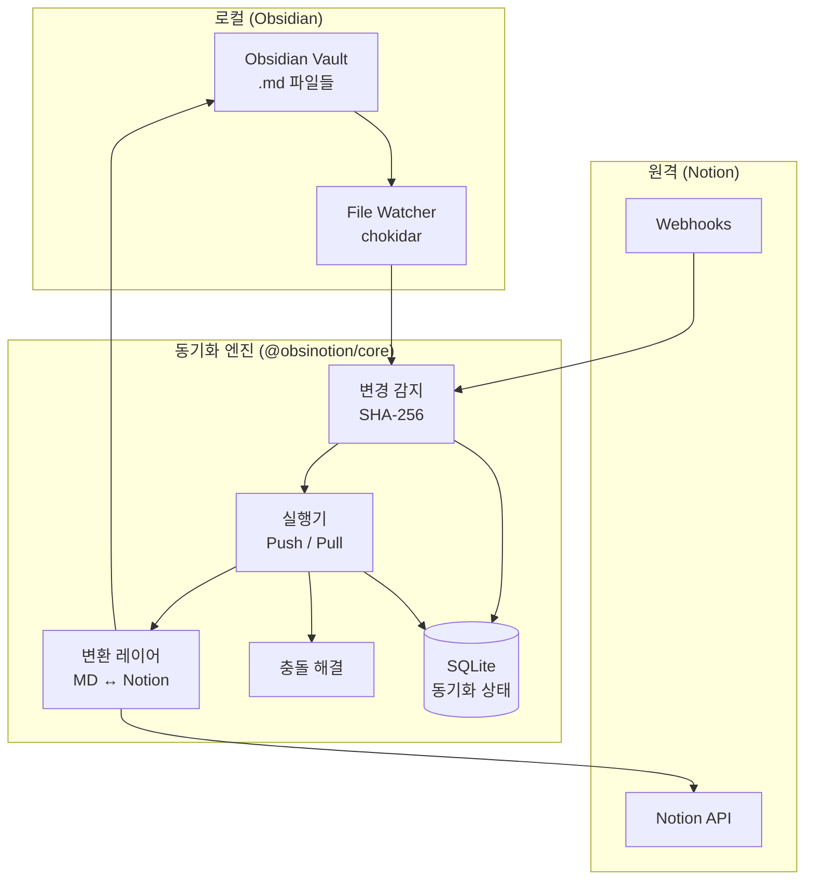

# 시스템 아키텍처

> 작성일: 2026-05-08
> 상태: draft
> Phase 2에서 상세 작성 예정 (Mermaid 다이어그램 포함)

## 전체 구조 (초안)

```mermaid
flowchart TD
    subgraph Local["로컬 (Obsidian)"]
        Vault[Obsidian Vault<br>.md 파일들]
        Watcher[File Watcher<br>chokidar]
    end

    subgraph Engine["동기화 엔진 (@obsinotion/core)"]
        Converter[변환 레이어<br>MD ↔ Notion]
        Differ[변경 감지<br>SHA-256]
        Executor[실행기<br>Push / Pull]
        Conflict[충돌 해결]
        State[(SQLite<br>동기화 상태)]
    end

    subgraph Remote["원격 (Notion)"]
        NotionAPI[Notion API]
        Webhook[Webhooks]
    end

    Vault --> Watcher
    Watcher --> Differ
    Webhook --> Differ
    Differ --> Executor
    Executor --> Converter
    Converter --> NotionAPI
    Converter --> Vault
    Executor --> Conflict
    Differ --> State
    Executor --> State
```

## 상세 설계 (Phase 2에서 작성)

- [ ] 변환 파이프라인 상세
- [ ] 동기화 알고리즘 상세
- [ ] 데이터 흐름 시퀀스 다이어그램
- [ ] 에러 처리 흐름
