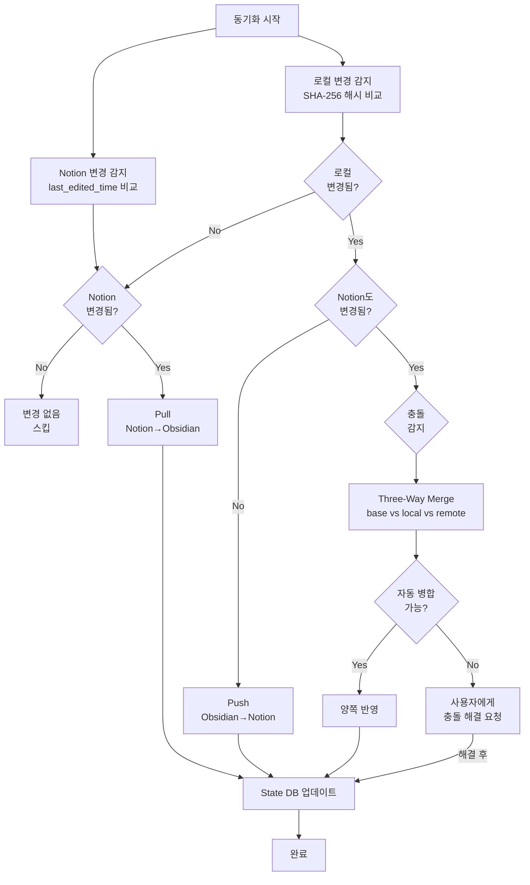

# 동기화 시나리오

> 작성일: 2026-05-08
> 상태: complete

## 동기화 모델 개요

### Git과의 비교

```
Git:        로컬 파일 ←── pull/push ──→ GitHub (원격 저장소)
ObsiNotion: Obsidian Vault ←── pull/push ──→ Notion Workspace (원격)
```

### 핵심 개념

| 용어              | 설명                                                                  |
| ----------------- | --------------------------------------------------------------------- |
| **Push**          | Obsidian → Notion. 로컬 변경사항을 Notion에 반영                      |
| **Pull**          | Notion → Obsidian. Notion 변경사항을 로컬에 반영                      |
| **Sync**          | Pull + Push를 한 번에 수행 (양방향)                                   |
| **State DB**      | SQLite 파일. 각 파일의 마지막 동기화 상태 기록 (git의 .git 폴더 역할) |
| **Base Snapshot** | 마지막 동기화 시점의 파일 내용. 충돌 감지의 기준점                    |

### 사용 방법 2가지

**CLI (터미널)**

```bash
obsinotion init          # 최초 설정 (Notion 토큰, 루트 페이지 연결)
obsinotion pull          # Notion → Obsidian
obsinotion push          # Obsidian → Notion
obsinotion sync          # Pull + Push 동시
obsinotion status        # 변경된 파일 목록 (git status 같은)
obsinotion diff README   # 파일별 변경 비교 (git diff 같은)
```

**Obsidian 플러그인**

```
설정 화면에서 Notion API 토큰 입력 → 루트 페이지 선택
→ 사이드바에 🔄 Sync 버튼 표시
→ 버튼 클릭 = sync (pull + push)
→ 설정에서 "자동 동기화" 켜면 파일 저장 시 자동 push
```

---

## 시나리오 1: 최초 연결 (Init)

### 상황

민수가 이미 Obsidian에 100개 노트가 있고, Notion은 비어있다.

### 과정

```
[1단계: 초기 설정]

$ obsinotion init

? Notion API Token: ntn_xxxxx...
  → (Notion Integration 페이지에서 토큰 발급)
? 동기화할 Notion 루트 페이지: "ObsiNotion Sync"
  → (빈 Notion 페이지를 하나 만들어서 선택)
? Obsidian Vault 경로: /Users/minsu/Documents/MyVault
? 동기화 대상 폴더: 전체 / 선택
  → 선택: ["Projects", "Notes", "Daily"]
  → 제외: [".obsidian", "templates", "_archive"]

✅ 설정 완료. .obsinotion/config.json 생성됨
✅ State DB 초기화: .obsinotion/sync.db
```

```
[2단계: 최초 Push]

$ obsinotion push

🔍 변경 감지 중...
  → 새 파일 87개 발견 (제외 폴더 빼고)
  → 이미지 23개 발견

📤 Obsidian → Notion 전송 중...
  [1/87] Projects/프로젝트A.md → Notion 페이지 생성
    → 프론트매터 → Notion Properties 변환
    → 본문 마크다운 → Notion 블록 변환
    → [[위키링크]] → 페이지 멘션 변환 (매핑 테이블 생성)
    → 이미지 3개 → Notion 파일 API 업로드
  [2/87] Projects/프로젝트B.md → ...
  ...
  [87/87] Daily/2026-05-08.md → ...

✅ Push 완료
   생성: 87 페이지
   이미지: 23개 업로드
   소요: 4분 32초 (API 3req/s 제한)
```

### 결과

```
Obsidian Vault                    Notion
─────────────                     ──────
📁 Projects/                      📄 ObsiNotion Sync (루트)
  📄 프로젝트A.md          →       └─ 📁 Projects
  📄 프로젝트B.md                       ├─ 📄 프로젝트A
📁 Notes/                               ├─ 📄 프로젝트B
  📄 아이디어 메모.md               └─ 📁 Notes
📁 Daily/                               ├─ 📄 아이디어 메모
  📄 2026-05-08.md                  └─ 📁 Daily
                                         └─ 📄 2026-05-08
```

---

## 시나리오 2: Obsidian에서 작성 → Notion에 Push

### 상황

민수가 Obsidian에서 새 노트를 작성했다.

### Obsidian에서 작성한 내용

```markdown
---
tags:
  - project/obsinotion
  - dev/typescript
status: active
priority: 1
---

# API 설계 문서

## 인증 방식

Notion API는 [[OAuth 2.0]] 또는 Internal Integration 방식을 지원한다.

> [!warning] 주의
> Internal Integration 토큰은 절대 커밋하지 말 것.

### 엔드포인트 목록

| 메서드 | 경로   | 설명        |
| ------ | ------ | ----------- |
| GET    | /pages | 페이지 목록 |
| POST   | /pages | 페이지 생성 |

$$E = mc^2$$

관련 문서: [[프로젝트A]], [[아키텍처 설계]]
```

### Push 과정 (내부 동작)

```
$ obsinotion push

🔍 변경 감지...
  → 새 파일: Notes/API 설계 문서.md
  → SHA-256: abc123... (이전 해시 없음 = 신규)

📤 변환 시작...

[Step 1: 프론트매터 → Notion Properties]
  tags: ["project/obsinotion", "dev/typescript"]
    → multi_select: [{name: "project/obsinotion"}, {name: "dev/typescript"}]
  status: "active"
    → select: {name: "active"}
  priority: 1
    → number: 1

[Step 2: 전처리기 (Pre-processor)]
  [[OAuth 2.0]]
    → 매핑 테이블 조회 → Notion 페이지 ID: "page-id-oauth"
    → [OAuth 2.0](notion://page-id-oauth)
  [[프로젝트A]]
    → 매핑 테이블 조회 → Notion 페이지 ID: "page-id-projA"
    → [프로젝트A](notion://page-id-projA)
  [[아키텍처 설계]]
    → 매핑 테이블에 없음 → 텍스트 링크로 보존 + 경고 로그
  > [!warning] 주의
    → ⚠️ + yellow_background callout 블록으로 변환 준비

[Step 3: 마크다운 → Notion 블록 (martian + 커스텀)]
  # API 설계 문서     → heading_1 블록
  ## 인증 방식         → heading_2 블록
  일반 텍스트          → paragraph 블록 (page mention 포함)
  > [!warning]         → callout 블록 (⚠️, yellow_background)
  ### 엔드포인트 목록   → heading_3 블록
  테이블               → table 블록 (3열 3행)
  $$E = mc^2$$         → equation 블록
  관련 문서: ...       → paragraph 블록 (page mention 포함)

[Step 4: Notion API 전송]
  POST /v1/pages (페이지 생성 + Properties)
  PATCH /v1/blocks/{id}/children (블록 추가, 100개씩 청킹)

[Step 5: State DB 업데이트]
  INSERT sync_state (
    local_path: "Notes/API 설계 문서.md",
    notion_id: "new-page-uuid",
    local_hash: "abc123...",
    notion_hash: "def456...",
    base_snapshot: "(변환된 내용 저장)",
    synced_at: "2026-05-08T15:30:00Z"
  )

✅ Push 완료: 1 파일 → 1 페이지 생성
```

### Notion에서 보이는 결과

```
📄 API 설계 문서
┌─────────────────────────────┐
│ Properties:                  │
│  Tags: project/obsinotion,   │
│        dev/typescript        │
│  Status: active              │
│  Priority: 1                 │
├─────────────────────────────┤
│                              │
│ # API 설계 문서              │
│                              │
│ ## 인증 방식                 │
│                              │
│ Notion API는 @OAuth 2.0 또는 │ ← @멘션 (클릭하면 해당 페이지로 이동)
│ Internal Integration 방식을  │
│ 지원한다.                    │
│                              │
│ ⚠️ 주의                      │ ← 노란 배경 callout
│ │ Internal Integration 토큰은│
│ │ 절대 커밋하지 말 것.       │
│                              │
│ ### 엔드포인트 목록           │
│                              │
│ ┌────────┬───────┬──────────┐│
│ │ 메서드 │ 경로  │ 설명     ││ ← 테이블
│ ├────────┼───────┼──────────┤│
│ │ GET    │/pages │페이지목록││
│ │ POST   │/pages │페이지생성││
│ └────────┴───────┴──────────┘│
│                              │
│     E = mc²                  │ ← 수식 블록 (렌더링됨)
│                              │
│ 관련 문서: @프로젝트A,       │
│           아키텍처 설계      │ ← 매핑 없어서 일반 텍스트
│                              │
└─────────────────────────────┘
```

---

## 시나리오 3: Notion에서 작성 → Obsidian에 Pull

### 상황

지은이가 Notion에서 새 페이지를 만들고 내용을 작성했다.

### Notion에서 작성한 내용

```
📄 마케팅 전략 2026
┌─────────────────────────────┐
│ Properties:                  │
│  Tags: marketing, Q2         │
│  Status: In Progress         │
│  Assignee: 지은              │
│  Due Date: 2026-06-30        │
├─────────────────────────────┤
│                              │
│ # 마케팅 전략 2026            │
│                              │
│ ## 목표                      │
│                              │
│ MAU 10,000 달성              │
│                              │
│ ┌──────────┬───────────┐     │
│ │ 왼쪽 컬럼 │ 오른쪽 컬럼│     │ ← 2단 Column Layout
│ │          │           │     │
│ │ 소셜미디어│ 블로그    │     │
│ │ - 인스타  │ - 기술블로그│    │
│ │ - 트위터  │ - 뉴스레터 │    │
│ └──────────┴───────────┘     │
│                              │
│ ⚠️ 예산 초과 주의             │ ← Notion Callout
│ │ Q1 대비 30% 증가 예상      │
│                              │
│ 참고: @프로젝트A              │ ← Page Mention
│                              │
│ 빨간 중요 텍스트              │ ← Red 텍스트 색상
│                              │
└─────────────────────────────┘
```

### Pull 과정 (내부 동작)

```
$ obsinotion pull

🔍 Notion 변경 감지 중...
  → Notion API: GET /v1/search (최근 수정된 페이지 조회)
  → 새 페이지 발견: "마케팅 전략 2026" (로컬에 없음)
  → 수정된 페이지: 0개

📥 Notion → Obsidian 변환 시작...

[Step 1: Notion Properties → 프론트매터]
  multi_select Tags: ["marketing", "Q2"]
    → tags: ["marketing", "Q2"]
  select Status: "In Progress"
    → status: "In Progress"
  rich_text Assignee: "지은"
    → assignee: "지은"
  date Due Date: "2026-06-30"
    → due_date: 2026-06-30

[Step 2: Notion 블록 → 마크다운 (notion-to-md + 커스텀)]
  heading_1         → # 마케팅 전략 2026
  heading_2         → ## 목표
  paragraph         → MAU 10,000 달성
  column_list       → (커스텀 후처리기가 처리)
  callout           → (커스텀 후처리기가 처리)
  page mention      → (커스텀 후처리기가 처리)
  colored text      → (커스텀 후처리기가 처리)

[Step 3: 후처리기 (Post-processor)]
  column_list (2 columns)
    → %% obsinotion:column_list:start:columns=2:widths=1,1 %%
      > [!col]
      >> [!col-md]
      >> 소셜미디어
      >> - 인스타
      >> - 트위터
      >
      >> [!col-md]
      >> 블로그
      >> - 기술블로그
      >> - 뉴스레터
      %% obsinotion:column_list:end %%

  callout (⚠️, yellow_background)
    → > [!warning] 예산 초과 주의
      > Q1 대비 30% 증가 예상

  page mention (프로젝트A, page-id-projA)
    → 매핑 테이블 역조회 → [[프로젝트A]]

  colored text (red)
    → <span class="notion-red">빨간 중요 텍스트</span>

[Step 4: 이미지 다운로드]
  → (이 페이지에는 이미지 없음)
  → (있었다면: pre-signed URL에서 즉시 다운로드 → attachments/ 저장)

[Step 5: 파일 쓰기]
  → Notes/마케팅 전략 2026.md 생성

[Step 6: State DB 업데이트]
  INSERT sync_state (
    local_path: "Notes/마케팅 전략 2026.md",
    notion_id: "page-uuid-marketing",
    local_hash: "xyz789...",
    notion_hash: "uvw321...",
    base_snapshot: "(내용 저장)",
    synced_at: "2026-05-08T16:00:00Z"
  )

✅ Pull 완료: 1 페이지 → 1 파일 생성
```

### Obsidian에서 보이는 결과

```markdown
---
tags:
  - marketing
  - Q2
status: "In Progress"
assignee: "지은"
due_date: 2026-06-30
notion_id: "page-uuid-marketing"
---

# 마케팅 전략 2026

## 목표

MAU 10,000 달성

%% obsinotion:column_list:start:columns=2:widths=1,1 %%

> [!col]
>
> > [!col-md]
> > 소셜미디어
> >
> > - 인스타
> > - 트위터
>
> > [!col-md]
> > 블로그
> >
> > - 기술블로그
> > - 뉴스레터
> >   %% obsinotion:column_list:end %%

> [!warning] 예산 초과 주의
> Q1 대비 30% 증가 예상

참고: [[프로젝트A]]

<span class="notion-red">빨간 중요 텍스트</span>
```

---

## 시나리오 4: 양쪽 동시 편집 → 충돌 해결

### 상황

민수가 Obsidian에서, 지은이가 Notion에서 같은 문서를 동시에 편집했다.

### 편집 내용

```
원본 (base snapshot):
  "MAU 10,000 달성"

민수 (Obsidian):
  "MAU 10,000 → 15,000으로 상향 조정"

지은 (Notion):
  "MAU 10,000 달성 (Q3 리뷰 후 재조정)"
```

### Sync 과정

```
$ obsinotion sync

🔍 변경 감지...
  → 로컬 파일 해시: abc... (변경됨. base snapshot과 다름)
  → Notion 페이지 해시: def... (변경됨. base snapshot과 다름)
  → ⚠️ 충돌 감지!

🔀 Three-Way Merge 시도...
  → base (마지막 동기화): "MAU 10,000 달성"
  → local (Obsidian):     "MAU 10,000 → 15,000으로 상향 조정"
  → remote (Notion):      "MAU 10,000 달성 (Q3 리뷰 후 재조정)"
  → 같은 라인 충돌 → 자동 병합 불가

❓ 충돌 해결 방법 선택:
  [1] 로컬 우선 (Obsidian 버전 유지)
  [2] 원격 우선 (Notion 버전 유지)
  [3] 수동 병합 (충돌 마커 삽입)

→ 사용자 선택: [3] 수동 병합

📝 충돌 마커 삽입:

  <<<<<<< OBSIDIAN (local)
  MAU 10,000 → 15,000으로 상향 조정
  =======
  MAU 10,000 달성 (Q3 리뷰 후 재조정)
  >>>>>>> NOTION (remote)

→ 사용자가 Obsidian에서 충돌 해결 후 다시 sync
```

### 충돌이 안 나는 경우 (다른 부분 편집)

```
민수 (Obsidian): "목표" 섹션 수정
지은 (Notion): "예산" 섹션 수정

→ Three-Way Merge 자동 성공
→ 양쪽 변경사항 모두 반영
→ 사용자에게 머지 결과 알림
```

---

## 시나리오 5: Notion Database ↔ Obsidian 폴더

### 상황

Notion에 "프로젝트 관리" 데이터베이스가 있다.

### Notion Database 구조

```
📊 프로젝트 관리 (Database)
┌─────────┬──────────┬──────┬───────────┬────────┐
│ 이름    │ 상태     │우선순│ 담당자    │ 마감일 │
├─────────┼──────────┼──────┼───────────┼────────┤
│ 웹 리뉴얼│ In Progress│ 1  │ 민수      │ 06-15  │
│ 앱 출시  │ To Do    │ 2   │ 지은      │ 07-01  │
│ API 문서 │ Done     │ 3   │ 현우      │ 05-30  │
└─────────┴──────────┴──────┴───────────┴────────┘

뷰:
- "전체 테이블" (table view, filter: none)
- "진행중" (board view, group by: 상태)
- "일정" (calendar view, date: 마감일)
```

### Pull 결과 (Obsidian)

```
databases/
  프로젝트 관리/
    ├── 웹 리뉴얼.md
    ├── 앱 출시.md
    ├── API 문서.md
    ├── _schema.yml           ← DB 스키마 메타 정보
    └── _views/
        ├── 전체 테이블.base  ← Table View
        ├── 진행중.md         ← Kanban Board View
        └── 일정.md           ← Calendar View
```

**웹 리뉴얼.md:**

```markdown
---
notion_id: "page-uuid-web"
notion_uid: "PROJ-1"
status: "In Progress"
status_group: "active"
priority: 1
assignee: "민수"
due_date: 2026-06-15
---

웹 리뉴얼 프로젝트 본문 내용...
```

**\_views/진행중.md (Kanban):**

```markdown
---
kanban-plugin: board
---

## To Do

- [ ] [[앱 출시]] @{2026-07-01}

## In Progress

- [ ] [[웹 리뉴얼]] @{2026-06-15}

## Done

- [x] [[API 문서]] @{2026-05-30}
```

**\_views/일정.md (Calendar):**

`````markdown
# 일정

````dataview
CALENDAR due_date
FROM "databases/프로젝트 관리"
WHERE due_date
```​
````
`````

````

### Obsidian에서 수정 → Push

민수가 "웹 리뉴얼.md"의 프론트매터를 수정:

```yaml
status: "Done" # In Progress → Done 변경
priority: 1 # 그대로
```

```
$ obsinotion push

📤 변환...
  웹 리뉴얼.md → Properties 업데이트
    status: select → "Done"
  → PATCH /v1/pages/{id} (Properties만 업데이트, 본문 변경 없음)

✅ Notion Database에서 "웹 리뉴얼" 행의 상태가 "Done"으로 변경됨
```

---

## 시나리오 6: 자동 동기화 (Obsidian 플러그인)

### 설정

```
ObsiNotion 플러그인 설정:
  ✅ 자동 Pull: 앱 시작 시 + 매 5분마다
  ✅ 자동 Push: 파일 저장 후 10초 디바운스
  ✅ 충돌 시: 알림 표시 (수동 해결)
```

### 동작 흐름

```
[앱 시작]
  → 백그라운드 Pull (Notion 변경사항 가져오기)
  → 충돌 없으면 조용히 반영
  → 충돌 있으면 🔔 알림: "3개 파일에 충돌이 있습니다"

[파일 편집 중]
  → chokidar가 파일 변경 감지
  → 10초 디바운스 (연속 타이핑 중에는 대기)
  → 타이핑 멈추면 자동 Push
  → 상태바: "🔄 동기화 중..." → "✅ 동기화 완료 15:30"

[5분마다]
  → 백그라운드 Pull
  → 새로 추가된 Notion 페이지 → 로컬 파일 생성
  → 수정된 페이지 → 로컬 파일 업데이트
  → 상태바에 결과 표시

[수동 동기화]
  → 사이드바 🔄 버튼 클릭
  → Pull + Push 즉시 실행
  → 또는 Command Palette: "ObsiNotion: Sync Now"
```

---

## 시나리오 7: 대용량 파일 처리

### Notion API 제한사항과 대응

```
제한: 블록 append 요청당 최대 100개
대응: 자동 청킹 (chunking)

예) 500개 블록 문서 Push:
  → [1/5] 블록 1-100 전송
  → [2/5] 블록 101-200 전송
  → ...
  → [5/5] 블록 401-500 전송

제한: rich_text 최대 2,000자
대응: 자동 분할

예) 3,000자 단락:
  → 단락1: 첫 2,000자
  → 단락2: 나머지 1,000자

제한: API Rate Limit 3 req/s
대응: async-sema 세마포어

예) 100개 파일 Push:
  → 초당 3개 요청씩 순차 처리
  → 예상 소요: ~2분
  → 진행률 표시: [34/100] 프로젝트A.md 처리중...
```

---

## 시나리오 8: 이미지 동기화

### Obsidian → Notion (Push)

```
1. 마크다운에서 이미지 참조 감지
   → 
   → ![[photo.jpg]]

2. 로컬 파일 존재 확인 + SHA-256 해시 계산

3. 이전에 업로드한 적 있는지 State DB 확인
   → 해시 일치 = 스킵 (중복 업로드 방지)
   → 해시 없음 = 업로드 필요

4. Notion File Upload API로 업로드
   → POST /v1/files (multipart/form-data)

5. 반환된 Notion 파일 URL을 이미지 블록에 연결
```

### Notion → Obsidian (Pull)

```
1. Notion 이미지 블록 감지
   → image block의 URL 추출

2. ⚠️ 핵심: Notion pre-signed URL은 1시간 후 만료!
   → 감지 즉시 다운로드 필수

3. attachments/ 폴더에 저장
   → SHA-256 해시로 파일명 생성 (중복 방지)
   → attachments/img_a1b2c3d4.png

4. 마크다운에 로컬 경로로 교체
   → 

5. State DB에 매핑 저장
   → notion_file_url ↔ local_path ↔ hash
```

---

## 동기화 상태 흐름도



---

## 에러 시나리오

### Rate Limit 초과

```
$ obsinotion push

📤 전송 중...
  [45/100] ⚠️ 429 Too Many Requests
  → 자동 백오프: 5초 대기 후 재시도
  → 재시도 1/3... 성공
  [46/100] 계속 진행...
```

### 네트워크 오류

```
$ obsinotion sync

📥 Pull 중...
  [12/50] ❌ 네트워크 오류 (ECONNRESET)
  → 3회 재시도 후 실패

⚠️ 부분 동기화 완료:
  성공: 11 파일
  실패: 1 파일 (Notes/큰문서.md)
  → 다음 sync 시 자동 재시도
  → 또는: obsinotion push Notes/큰문서.md (수동 재시도)
```

### 파일 삭제 처리

```
$ obsinotion sync

🗑️ 삭제 감지:
  로컬에서 삭제됨: Notes/오래된메모.md

? 삭제 정책 (설정에서 변경 가능):
  [1] Notion에서도 삭제 (archive)
  [2] Notion에서 보존 (로컬만 삭제)  ← 기본값
  [3] 매번 물어보기

→ 기본값 적용: Notion 페이지 보존
→ State DB에서 매핑만 제거
```
````
