# Im-Nobsidian: Getting Started Guide

> The complete step-by-step guide to sync your Obsidian vault with Notion.

<p align="center">
  
</p>

---

**Table of Contents**

- [Prerequisites](#prerequisites)
- [Step 1: Install Im-Nobsidian](#step-1-install-im-nobsidian)
- [Step 2: Create a Notion Integration](#step-2-create-a-notion-integration)
- [Step 3: Connect Your Notion Page](#step-3-connect-your-notion-page)
- [Step 4: Initialize Your Vault](#step-4-initialize-your-vault)
- [Step 5: Push Your First Notes](#step-5-push-your-first-notes)
- [Step 6: Pull Changes from Notion](#step-6-pull-changes-from-notion)
- [Step 7: Bidirectional Sync](#step-7-bidirectional-sync)
- [Working with Large Vaults](#working-with-large-vaults)
- [Troubleshooting](#troubleshooting)

---

## Prerequisites

Before you start, make sure you have:

- **Node.js 20+** installed ([download](https://nodejs.org))
- An **Obsidian vault** with markdown files
- A **Notion account** (free or paid)

---

## Step 1: Install Im-Nobsidian

```
npm install -g im-nobsidian
```

Verify the installation:

```
nobsi --version
```

You should see `0.1.0`. The `nobsi` command is now available globally.

> **Note:** You can also use `npx im-nobsidian` without installing globally.

---

## Step 2: Create a Notion Integration

Go to [notion.so/my-integrations](https://www.notion.so/my-integrations) and click **"New integration"**.

<!-- Screenshot: Notion integration creation page -->


Configure the integration:

| Setting              | Value                                 |
| -------------------- | ------------------------------------- |
| Name                 | `Im-Nobsidian` (or anything you want) |
| Associated workspace | Your workspace                        |
| Content Capabilities | Read, Update, Insert content          |

After creating, copy the **Internal Integration Secret** (starts with `ntn_`). You'll need this in Step 4.

> **Important:** Keep this token private. Never commit it to git or share it publicly.

---

## Step 3: Connect Your Notion Page

In Notion, create a new page (or use an existing one) that will be the **root** of your sync. All your Obsidian files will appear as child pages under this page.

1. Open the page in Notion
2. Click `···` (top-right menu)
3. Go to **Connections**
4. Find and add your **Im-Nobsidian** integration

<!-- Screenshot: Notion page with connection added -->


Your Notion page is now accessible via the API.

---

## Step 4: Initialize Your Vault

Open your terminal, navigate to your Obsidian vault, and run:

```
cd ~/Documents/Obsidian\ Vault
nobsi init
```

The interactive setup will guide you:

```
? Notion Internal Integration Token: ntn_****
✔ Notion 연결 성공

사용 가능한 루트 페이지:
  [1] Im-Nobsidian
  [2] Projects

? 루트 페이지 ID: (select or paste the page ID)

✓ Im-Nobsidian 초기화 완료!
  설정: .im-nobsidian/config.json
  DB: .im-nobsidian/sync.db
```

This creates a `.im-nobsidian/` folder in your vault with configuration and sync state.

> **Tip:** Add `.im-nobsidian/` to your `.gitignore` if your vault is in a git repo.

---

## Step 5: Push Your First Notes

Start with a dry run to see what will be synced:

```
nobsi push --dry-run
```

When you're ready, push for real:

```
nobsi push
```

```
◠ Push 중... [1/12] test-note.md
◠ Push 중... [7/12] api-design.md
◠ Push 중... [12/12] journal.md

✓ Push 완료 (4.2s)
  생성: 12
  수정: 0
  삭제: 0
```

Open Notion and check your root page — all your notes should be there, preserving:

- Headings, bold, italic, strikethrough
- Code blocks with language syntax highlighting
- Lists, checkboxes, tables
- Math equations (LaTeX)
- Blockquotes and callouts
- Frontmatter → property table

<!-- Screenshot: Notion showing synced pages -->


---

## Step 6: Pull Changes from Notion

Edit a page in Notion — change some text, add a paragraph, modify a table.

Then pull the changes:

```
nobsi pull
```

```
✓ Pull 완료 (2.1s)
  생성: 0
  수정: 3
  삭제: 0
```

Open the modified files in Obsidian. The Notion changes are now in your local files, with YAML frontmatter preserved.

---

## Step 7: Bidirectional Sync

The `sync` command does both pull and push in one step:

```
nobsi sync
```

```
✓ Sync 완료 (5.8s)
  Push: 2 생성  Pull: 3 수정
```

### What about conflicts?

When both sides change the same file, Im-Nobsidian detects the conflict:

```
nobsi status
```

```
Conflicts:
  ✕ notes/meeting.md — modified on both sides

nobsi resolve
```

You can configure the conflict strategy in `.im-nobsidian/config.json`:

```json
{
  "sync": {
    "conflictStrategy": "ask"
  }
}
```

| Strategy      | Behavior                                      |
| ------------- | --------------------------------------------- |
| `ask`         | Prompt you to choose (default)                |
| `local-wins`  | Always keep the Obsidian version              |
| `remote-wins` | Always keep the Notion version                |
| `manual`      | Insert conflict markers for manual resolution |

---

## Working with Large Vaults

If you have hundreds of notes, don't push everything at once. Use these strategies:

### Exclude files with `.im-nobsidian-ignore`

Create `.im-nobsidian-ignore` in your vault root (same syntax as `.gitignore`):

```
# Obsidian internal files
.obsidian
.trash

# Templates and attachments
templates/
attachments/

# Large or generated files
*.excalidraw.md
```

### Push folder by folder

Use the `--path` flag to sync specific folders:

```
# Push only the "projects" folder
nobsi push --path "projects"

# Then another folder
nobsi push --path "notes"

# Check overall status
nobsi status
```

### What happens if it stops midway?

**Your data is safe.** Each file is saved to the sync database immediately after successful sync. If the process is interrupted:

- Already synced files: saved in database, won't be re-uploaded
- Failed files: listed in the output, will be retried next run
- No data loss, ever

---

## Troubleshooting

### "Notion 연결 실패"

- Check that your token starts with `ntn_`
- Make sure the integration is connected to the correct workspace

### Pages not appearing in Notion

- Verify the integration is added to your root page (Step 3)
- Check with `nobsi status` to see if files were detected

### Rate limit errors

Notion limits API requests to 3/second. Im-Nobsidian handles this automatically with retry + exponential backoff. For very large vaults (500+ files), the sync may take a few minutes — this is normal.

### Verbose logging

Add `--verbose` for detailed output:

```
nobsi push --verbose
```

### Reset sync state

If something goes wrong, you can reset and start fresh:

```
rm .im-nobsidian/sync.db
nobsi push
```

---

## What's Next?

- **`nobsi watch`** — Auto-sync when files change
- **`nobsi diff [path]`** — See differences between local and Notion
- Read the full [CLI Reference](../../README.md#cli-reference) for all commands and options

---

**Need help?** Open an issue at [github.com/JaylenAI/Im-Nobsidian/issues](https://github.com/JaylenAI/Im-Nobsidian/issues)
